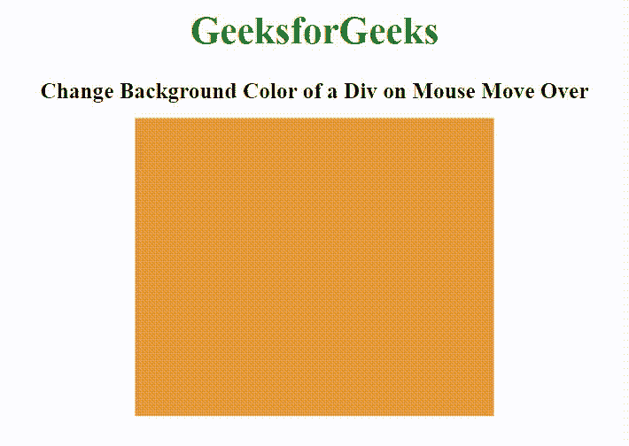

# 如何用 JavaScript 在鼠标移动时改变`div`的背景颜色？

> 原文:[https://www . geeksforgeeks . org/如何更改背景色-鼠标上的 div-移动-使用 javascript/](https://www.geeksforgeeks.org/how-to-change-background-color-of-a-div-on-mouse-move-over-using-javascript/)

使用 HTML、CSS 和 Javascript 可以轻松更改 div 框的背景颜色。我们将使用 **[querySelector()](https://www.geeksforgeeks.org/html-dom-queryselector-method/)** 和**[addEventListener()](https://www.geeksforgeeks.org/html-dom-addeventlistener-method/)**方法选择元素，然后应用一些数学逻辑来更改其背景颜色。以下部分将指导您如何创建效果。

**HTML 代码:**在本节中，我们将创建身体的基本结构。正文部分包含一个< div >元素，当鼠标移动到 div 元素上时，背景颜色将会改变。

```html
<!DOCTYPE html>
<html lang="en" dir="ltr">

<head>
    <meta charset="utf-8">
    <title>
        How to Change Background Color
        of a Div on Mouse Move Over
        using JavaScript ?
    </title>
</head>

<body>
    <div class="first"></div>
</body>

</html>
```

**CSS 代码:**在本节中，我们将使用一些 CSS 属性来设置 div 元素的样式。

```html
<style>
    .first {
        position: absolute;
        background: #E73C49;
        width: 300px;
        height: 250px;
        top: 50%;
        left: 50%;
        transform: translate(-50%, -50%);
    }
</style>
```

**Javascript 代码:**
**第一步:**第一步是创建一个由不同颜色组成的数组。

**第二步:**第二步使用 **querySelector()** 方法选择 div 元素，然后使用**addevelistener()**方法为其附加一个事件处理程序(鼠标悬停)。

**第三步:**在最后一步中，我们将使用一些逻辑来设置 div 元素的背景样式，即我们将在数组上使用 **Math.random()** 函数来返回数组范围之间的浮点数，然后使用 **Math.floor()** 方法将浮点数向下舍入到其最近的整数。

```html
<script type="text/javascript">

    var color = [, "#3C9EE7", "#E7993C", 
        "#E73C99", "#3CE746", "#E7993C"];

    document.querySelector("div").addEventListener(
            "mouseover", function () {

        document.querySelector("div").style.background 
            = color[Math.floor(Math.random() * color.length)];
    })
</script>
```

**完整代码:**在本节中，我们将结合以上三个代码部分。

```html
<!DOCTYPE html>
<html>

<head>
    <meta charset="utf-8">
    <title>
        How to Change Background Color
        of a Div on Mouse Move Over
        using JavaScript ?
    </title>

    <style>
        .first {
            position: absolute;
            background: #E73C49;
            width: 300px;
            height: 250px;
            top: 50%;
            left: 50%;
            transform: translate(-50%, -50%);
        }
    </style>
</head>

<body>
    <div class="first"></div>

    <script type="text/javascript">
        var color = [, "#3C9EE7", "#E7993C",
            "#E73C99", "#3CE746", "#E7993C"];

        document.querySelector("div").addEventListener(
                    "mouseover", function () {

            document.querySelector("div").style.background 
                = color[Math.floor(Math.random() * color.length)];
        })
    </script>
</body>

</html>
```

**输出:**
