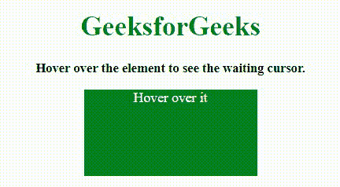
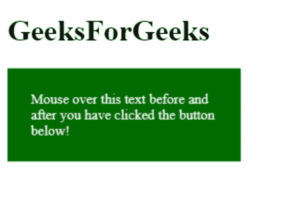

# 如何在 JavaScript/jQuery 中将光标变为等待状态？

> 原文:[https://www . geesforgeks . org/如何将光标更改为 javascript 中的等待状态-jquery/](https://www.geeksforgeeks.org/how-to-change-cursor-to-waiting-state-in-javascript-jquery/)

给定一个 HTML 文档，任务是当鼠标在一个元素上移动时获取等待状态光标。在这里，我们将通过允许对游标进行操作的游标属性来实现这一点。我们将在 JavaScript 的帮助下做到这一点。
**进场:**

*   使用**光标属性**。
*   当需要等待光标时，将其值设置为**进度**。
*   当需要标准光标时，将其值设置为**默认值**。

可以使用以下语法更改光标:

```
object.style.cursor = value
```

**例 1:**

## 超文本标记语言

```
<!DOCTYPE HTML> 
<html> 

<head>
    <title>
        How to change cursor to waiting
        in JavaScript/jQuery ?
    </title>

    <script src=
        "https://ajax.googleapis.com/ajax/libs/jquery/3.4.1/jquery.min.js">
    </script>

    <style>
        #div {
            height: 100px;
            width: 200px;
            background: green;
            color: white;
            margin: 0 auto;
        }
    </style>
</head>

<body style = "text-align:center;"> 

    <h1 id = "h1" style = "color:green;" > 
        GeeksforGeeks
    </h1>

    <p id = "GFG_UP" style =
        "font-size: 15px; font-weight: bold;">
    </p>

    <div id = "div">
        Hover over it
    </div>

    <script>
        var el_up = document.getElementById("GFG_UP");
        var heading = document.getElementById("h1");
        var div = document.getElementById("div");
        el_up.innerHTML = "Hover over the element "
                    + "to see the waiting cursor.";

        $("#div").hover(function() {
            $(this).css("cursor", "progress");
        }, function() {
            $(this).css("cursor", "default");
        }); 
    </script>
</body>

</html>
```

**输出:**



**例 2:**

## 超文本标记语言

```
<!DOCTYPE HTML> 
<html> 

<head>
    <title>
        How to change cursor to waiting
        in JavaScript/jQuery ?
    </title>

    <script src=
        "https://ajax.googleapis.com/ajax/libs/jquery/3.4.1/jquery.min.js">
    </script>

    <style>
        #div {
            height: 100px;
            width: 200px;
            background: green;
            color: white;
            margin: 0 auto;
        }
        .cursor {
               cursor: progress;
           }
    </style>
</head>

<body style = "text-align:center;"> 

    <h1 id = "h1" style = "color:green;" > 
        GeeksforGeeks
    </h1>

    <p id = "GFG_UP" style =
        "font-size: 15px; font-weight: bold;">
    </p>

    <div id = "div">
        Hover over it
    </div>

    <script>
        var el_up = document.getElementById("GFG_UP");
        var heading = document.getElementById("h1");
        var div = document.getElementById("div");
        el_up.innerHTML = "Hover over the element "
                    + "to see the waiting cursor.";

        $("#div").hover(function() {
            $(this).addClass('cursor');
        }, function() {
            $(this).removeClass('cursor');
        }); 
    </script>
</body> 

</html>
```

**输出:**


**例 3:**

## 超文本标记语言

```
<!DOCTYPE html>
<html>
  <head>
    <title>Document</title>
    <style>
      #demo {
        width: 200px;
        height: 50px;
        padding: 25px;
        background-color: green;
        color: white;
        font-size: 15px;
      }
    </style>
  </head>
  <body>
    <h1>Welcome to GeeksForGeeks</h1>
    <p id="demo" onmouseover="myFunction()">
      Mouse over this text before and after you have clicked the button below!
    </p>

    <script>
      function myFunction() {
        document.getElementById("demo").style.cursor = "wait";
      }
    </script>
  </body>
</html>
```

**输出:**



在上面的例子中，我们在

标签中使用了 onmouseover 属性，它在