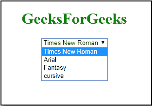

# 如何在 JavaScript 中使用下拉列表改变字体样式？

> 原文:[https://www . geesforgeks . org/how-change-font-style-use-下拉列表-in-javascript/](https://www.geeksforgeeks.org/how-to-change-font-style-using-drop-down-list-in-javascript/)

要更改或设置某些文本的字体样式，需要更改[字体系列 CSS 属性](https://www.geeksforgeeks.org/css-font-family-property/)。fontFamily 属性设置或返回元素中文本的字体系列名称列表。

**语法:**

```html
*object*.style.fontFamily = "font"
```

**通过选项下拉菜单改变字体样式:**字体值可以使用[选项值](https://www.geeksforgeeks.org/html-option-value-attribute/)在选项标签中传递。

**语法:**

```html
<option value="value">
```

value 属性指定提交表单时要发送的值。因此，在选择了要发送的值之后，我们将元素中文本的 fontFamily 属性设置为上面语法中指定的选定值。在 javascript 函数中，这里 *changeFontStyle()* ，fontFamily 属性值被设置为所选选项的字体值。默认情况下，它设置为 Times New Roman。

**示例:**

```html
<!DOCTYPE html>
<html>

<head>
    <title>
        Change Font Style by Option
        Dropdown Javascript
    </title>
</head>

<body style="text-align:center;">

    <div id="output-text">
        <h1 style="color:green;">
            GeeksForGeeks
        </h1>
    </div>

    <select id="input-font" class="input"
        onchange="changeFontStyle (this);">

        <option value="Times New Roman" 
            selected="selected">
            Times New Roman
        </option>
        <option value="Arial">Arial</option>
        <option value="fantasy">Fantasy</option>
        <option value="cursive">cursive</option>
    </select>

    <script>
        var changeFontStyle = function (font) {
            document.getElementById(
                "output-text").style.fontFamily
                        = font.value;
        }
    </script>
</body>

</html>
```

**输出:**

*   **在选择任何选项之前(初始值–新罗马时代):**
    
*   **在下拉列表中选择一个选项后:**
    
*   **在下拉列表中选择另一个选项后:**
    