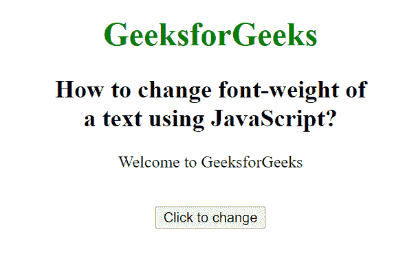
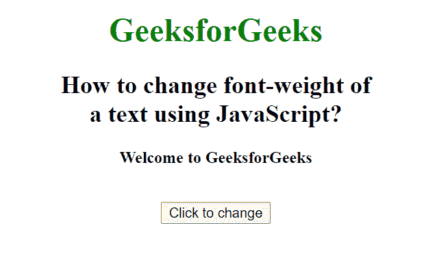

# 如何使用 JavaScript 改变文本的字体粗细？

> 原文:[https://www . geesforgeks . org/如何使用 javascript 更改文本字体粗细/](https://www.geeksforgeeks.org/how-to-change-font-weight-of-a-text-using-javascript/)

在本文中，我们将使用 JavaScript 动态设置文本的字体粗细。为了动态改变字体的粗细，我们使用了字体粗细属性。

**语法:**

```html
object.style.fontWeight = "value"
```

**属性值:**

*   **正常:**字体粗细为默认值。
*   **较轻:**字体粗细是正常情况下的较轻。
*   **加粗:**字体粗细较正常加粗。
*   **加粗:**字体粗细加粗。
*   **值:**定义从 100 到 900，其中 400 为正常值。
*   **初始:**设置为默认字体粗细。
*   **inherit:** 它从其父元素继承该属性。

**示例:**

## 超文本标记语言

```html
<!DOCTYPE html>
<html>

<head>
    <title>
        How to change font-weight of
        a text using JavaScript?
    </title>
</head>

<body style="text-align: center;">

    <h1 style="color: green">
        GeeksforGeeks
    </h1>

    <h2>
        How to change font-weight of
        <br>a text using JavaScript?
    </h2>

    <p id="sudo">Welcome to GeeksforGeeks</p>

    <br>

    <button type="button" onclick="myGeeks()">
        Click to change
    </button>

    <script>
        function myGeeks() {
            document.getElementById("sudo")
                .style.fontWeight = "bold";
        } 
    </script>
</body>

</html>
```

**输出:**

**点击按钮前:**



**点击按钮后:**



**支持的浏览器:**

*   谷歌 Chrome
*   微软公司出品的 web 浏览器
*   Mozilla Firefox
*   歌剧
*   旅行队