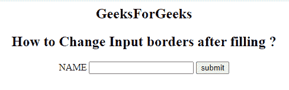
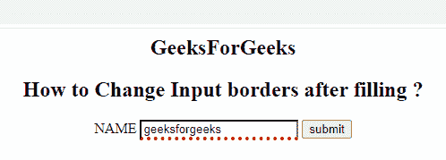

# 填充输入框后，如何使用 JavaScript 更改输入框边框？

> 原文:[https://www . geeksforgeeks . org/如何更改-输入框-边框-填充后-使用-javascript/](https://www.geeksforgeeks.org/how-to-change-input-box-borders-after-filling-the-box-using-javascript/)

在本文中，我们将在输入文本字段上填充文本后更改输入边框。当元素的值改变并从列表中选择新值时， **onchange** 事件属性起作用。

**方法:**每当用户用某个值改变输入值时，触发 **onchange** 事件属性。事件触发后，如果该值不为空，则检查该值。如果用户值存在，则通过使用内联样式将输入控件的下边框更改为点红色。

**语法:**

```html
<element onchange = "script">
```

**示例:**在本例中，当用户在字段中键入一些文本时，我们将更改*边框底部样式*。

```html
<!DOCTYPE html>
<html>

<body style="text-align: center;">
    <h2>GeeksForGeeks</h2>

    <h2>
        How to Change Input 
        borders after filling?
    </h2>

    <form>
        <label> NAME</label>
        <input type="text" id="fname" 
                name="fname" value="">
        <input type="submit" value="submit">
    </form>

    <script>
        var gfg = document.getElementById("fname");
        gfg.onchange = function (e) {
            if (gfg.value != '') {
                e.target.style.borderBottom 
                        = "4px dotted red";
            }
        };
    </script>
</body>

</html>
```

**输出:**

*   **前填文字:** 
*   **后补文字:**
    

**支持的浏览器:**

*   谷歌 Chrome
*   微软公司出品的 web 浏览器
*   歌剧
*   旅行队