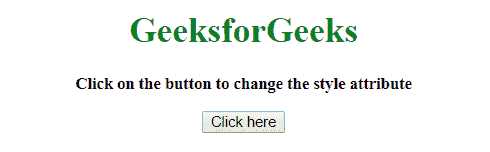
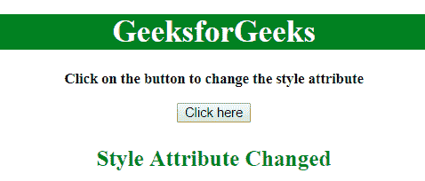
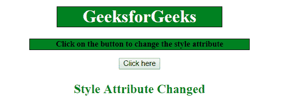

# 如何使用 JavaScript 动态改变元素的样式属性？

> 原文:[https://www . geesforgeks . org/如何使用 javascript 动态更改元素的样式属性/](https://www.geeksforgeeks.org/how-to-change-style-attribute-of-an-element-dynamically-using-javascript/)

给定一个 HTML 文档，任务是在 JavaScript 的帮助下动态改变元素的样式属性(CSS 属性)。

**进场:**

*   选择其样式属性需要更改的元素。
*   使用**元素. style** 属性设置元素的样式属性。
*   使用**括号符号**或**破折号**设置属性。

**示例 1:** 本示例更改标题元素的颜色和背景色。

```
<!DOCTYPE HTML> 
<html> 

<head> 
    <title> 
        How to change style attribute of an element
        dynamically using JavaScript ?
    </title>
</head> 

<body style = "text-align:center;" id = "body"> 

    <h1 id = "h1" style = "color:green;" > 
        GeeksforGeeks 
    </h1>

    <p id = "GFG_UP" style = 
            "font-size: 15px; font-weight: bold;">
    </p>

    <button onclick = "gfg_Run()"> 
        Click here
    </button>

    <p id = "GFG_DOWN" style = 
        "font-size: 23px; font-weight: bold; color: green; ">
    </p>

    <script>
        var el_up = document.getElementById("GFG_UP");
        var el_down = document.getElementById("GFG_DOWN");
        var heading = document.getElementById("h1");
        el_up.innerHTML = "Click on the button to "
                        + "change the style attribute";

        function gfg_Run() {
            heading.style["background-color"] = "green";
            heading.style["color"] = "white";
            el_down.innerHTML = "Style Attribute Changed";
        }         
    </script> 
</body> 

</html>
```

**输出:**

*   **点击按钮前:**
    
*   **点击按钮后:**
    

**示例 2:** 本示例更改元素的颜色、背景色和宽度属性。

```
<!DOCTYPE HTML> 
<html> 

<head> 
    <title> 
        How to change style attribute of an element
        dynamically using JavaScript ?
    </title>
</head> 

<body> 
    <center>
        <h1 id = "h1" style = "color:green;" > 
            GeeksforGeeks 
        </h1>

        <p id = "GFG_UP" style = 
                "font-size: 15px; font-weight: bold;">
        </p>

        <button onclick = "gfg_Run()"> 
            Click here
        </button>

        <p id = "GFG_DOWN" style = 
            "font-size: 23px; font-weight: bold; color: green; ">
        </p>

        <script>
            var el_up = document.getElementById("GFG_UP");
            var el_down = document.getElementById("GFG_DOWN");
            var heading = document.getElementById("h1");
            el_up.innerHTML = "Click on the button to "
                            + "change the style attribute";

            function gfg_Run() {
                heading.style["color"] = "white";
                heading.style["background-color"] = "green";
                heading.style["width"] = "300px";
                heading.style["border"] = "1px solid black";

                el_up.style["background-color"] = "green";
                el_up.style["width"] = "400px";
                el_up.style["border"] = "1px solid black";

                el_down.innerHTML = "Style Attribute Changed";
            }         
        </script> 
    </center>
</body> 

</html>
```

**输出:**

*   **点击按钮前:**
    
*   **点击按钮后:**
    