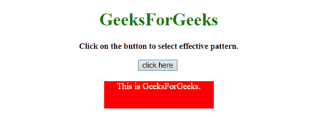
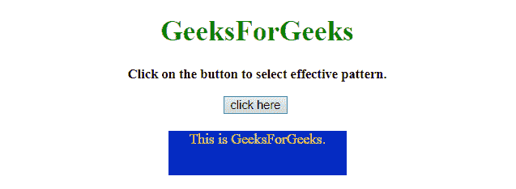

# 如何使用 JavaScript 根据背景颜色改变文字颜色？

> 原文:[https://www . geesforgeks . org/how-change-text-color-on-background-color-use-JavaScript/](https://www.geeksforgeeks.org/how-to-change-text-color-depending-on-background-color-using-javascript/)

任务是根据背景颜色设置前景色，使其变得可见。这里很少讨论一些重要的技术。我们将使用 JavaScript。

**进场:**

*   首先选择随机的背景颜色(通过选择随机的 RGB 值)或特定的颜色。
*   使用 YIQ 公式得到 YIQ 值。
*   根据 YQ 值，选择有效的前景色。

**示例 1:** 该示例使用上述方法。

```
<!DOCTYPE HTML>
<html>

<head>
    <title>
        How to change text color depending 
      on background color using JavaScript?
    </title>
    <script src=
"https://ajax.googleapis.com/ajax/libs/jquery/2.1.1/jquery.min.js">
    </script>
    <style>
        #backG {
            width: 200px;
            height: 50px;
            color: white;
            background: green;
            margin: 0 auto;
        }
    </style>
</head>

<body id="body" align="center">
    <h1 style="color:green;">  
            GeeksForGeeks  
        </h1>
    <p id="GFG_UP" 
       style="font-size: 15px;
              font-weight: bold;">
    </p>
    <button onclick="GFG_Fun()">
        click here
    </button>
    <br>
    <br>
    <div id="backG">This is GeeksForGeeks.</div>
    <script>
        var el_up = document.getElementById('GFG_UP');
        var rgbValue = [255, 0, 0];
        el_up.innerHTML = 
          "Click on the button to select effective pattern.";

        function setColor() {
            rgbValue[0] = Math.round(Math.random() * 255);
            rgbValue[1] = Math.round(Math.random() * 255);
            rgbValue[2] = Math.round(Math.random() * 255);
            var color = Math.round(((parseInt(rgbValue[0]) * 299) +
                (parseInt(rgbValue[1]) * 587) +
                (parseInt(rgbValue[2]) * 114)) / 1000);
            var textColor = (color > 125) ? 'black' : 'white';
            var backColor = 
                'rgb(' + rgbValue[0] + ', ' + rgbValue[1] + ', '
             + rgbValue[2] + ')';

            $('#backG').css('color', textColor);
            $('#backG').css('background-color', backColor);
        }

        function GFG_Fun() {
            setColor();
        }
    </script>
</body>

</html>
```

**输出:**

*   **点击按钮前:**
    
*   **点击按钮后:**
    

**示例 2:** 该示例使用了上面讨论的方法，但不仅仅使用黑色和白色作为前景。

```
<!DOCTYPE HTML>
<html>

<head>
    <title>
        How to change text color depending
      on background color using JavaScript?
    </title>
    <script src=
"https://ajax.googleapis.com/ajax/libs/jquery/2.1.1/jquery.min.js">
    </script>
    <style>
        #backG {
            width: 200px;
            height: 50px;
            color: white;
            background: green;
            margin: 0 auto;
        }
    </style>
</head>

<body id="body" align="center">
    <h1 style="color:green;">  
            GeeksForGeeks  
        </h1>
    <p id="GFG_UP" 
       style="font-size: 15px; font-weight: bold;">
    </p>
    <button onclick="GFG_Fun()">
        click here
    </button>
    <br>
    <br>
    <div id="backG">This is GeeksForGeeks.</div>
    <script>
        var el_up = document.getElementById('GFG_UP');
        var rgbValue = [255, 0, 0];
        el_up.innerHTML = 
          "Click on the button to select effective pattern.";

        function getforeGColor(rgb) {
            var cols = rgb.match(/^rgb\((\d+), \s*(\d+), \s*(\d+)\)$/);
            var b = 1;
            var rValue = cols[1];
            var gValue = cols[2];
            var bValue = cols[3];
            var rV = Math.floor((255 - rValue) * b);
            var gV = Math.floor((255 - gValue) * b);
            var bV = Math.floor((255 - bValue) * b);
            return 'rgb(' + rV + ', ' + gV + ', ' + bV + ')';
        }

        function setColor() {
            rgbValue[0] = Math.round(Math.random() * 255);
            rgbValue[1] = Math.round(Math.random() * 255);
            rgbValue[2] = Math.round(Math.random() * 255);
            var color = Math.round(((parseInt(rgbValue[0]) * 299) +
                (parseInt(rgbValue[1]) * 587) +
                (parseInt(rgbValue[2]) * 114)) / 1000);
            var backColor = 
                'rgb(' + rgbValue[0] + ', ' + rgbValue[1] + ', '
             + rgbValue[2] + ')';

            var textColor = getforeGColor(backColor);
            $('#backG').css('color', textColor);
            $('#backG').css('background-color', backColor);
        }

        function GFG_Fun() {
            setColor();
        }
    </script>
</body>

</html>
```

**输出:**

*   **点击按钮前:**
    
*   **点击按钮后:**
    