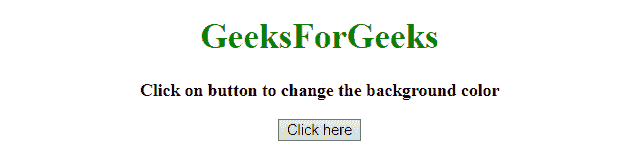
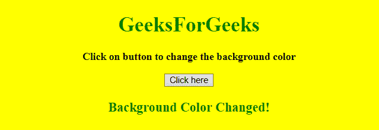
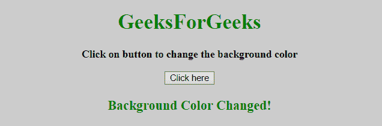

# 如何在 JavaScript 中点击按钮后改变背景颜色？

> 原文:[https://www . geesforgeks . org/如何在 javascript 中点击按钮后更改背景颜色/](https://www.geeksforgeeks.org/how-to-change-the-background-color-after-clicking-the-button-in-javascript/)

给定一个 HTML 文档，任务是使用 JavaScript 和 jQuery 更改文档的背景颜色。

**方法 1:** 该方法使用 JavaScript 在点击按钮后改变背景颜色。
点击按钮后，使用[HTML DOM Style background color Property](https://www.geeksforgeeks.org/html-dom-style-backgroundcolor-property/)更改背景颜色。此属性用于设置元素的背景色。

**示例:**本示例借助 **JavaScript** 改变背景颜色。

```
<!DOCTYPE HTML> 
<html> 
    <head> 
        <title> 
            How to change the background color
            after clicking the button ?
        </title>
    </head> 

    <body style = "text-align:center;">

        <h1 style = "color:green;" > 
            GeeksForGeeks 
        </h1> 

        <p id = "GFG_UP" style =
            "font-size: 16px; font-weight: bold;">     
        </p>

        <button onclick = "gfg_Run()"> 
            Click here
        </button>

        <p id = "GFG_DOWN" style =
            "color:green; font-size: 20px; font-weight: bold;">
        </p>

        <script>
            var el_up = document.getElementById("GFG_UP");
            var el_down = document.getElementById("GFG_DOWN");
            var str = "Click on button to change the background color";

            el_up.innerHTML = str;

            function changeColor(color) {
                document.body.style.background = color;
            }

            function gfg_Run() {
                changeColor('yellow');
                el_down.innerHTML = "Background Color changed";
            }         
        </script> 
    </body> 
</html>                    
```

**输出:**

*   **点击按钮前:**
    
*   **点击按钮后:**
    

**方法二:**该方法使用 jQuery 在点击按钮后改变背景颜色。

*   text()方法用于设置选定元素的文本内容。
*   on()方法用作选定元素和子元素的事件处理程序。
*   css()方法用于更改/设置元素的背景颜色。

**示例:**本示例借助 **JQuery** 改变背景颜色。

```
<!DOCTYPE HTML> 
<html> 
    <head> 
        <title> 
            How to change the background color after
            clicking the button in jQuery ?
        </title>

        <script src =
"https://ajax.googleapis.com/ajax/libs/jquery/3.4.0/jquery.min.js">
        </script>
    </head> 

    <body style = "text-align:center;">

        <h1 style = "color:green;" > 
            GeeksForGeeks 
        </h1> 

        <p id = "GFG_UP" style = 
            "font-size: 16px; font-weight: bold;">     
        </p>

        <button> 
            Click here
        </button>

        <p id = "GFG_DOWN" style = 
            "color:green; font-size: 20px; font-weight: bold;">
        </p>

        <script>
            $('#GFG_UP').text("Click on button to change the background color");
            $('button').on('click', function() {
                $('body').css('background', '#ccc');
                $('#GFG_DOWN').text("Background Color Changed!");
            }); 
        </script> 
    </body> 
</html>                    
```

**输出:**

*   **点击按钮前:**
    
*   **点击按钮后:**
    

JavaScript 最出名的是网页开发，但它也用于各种非浏览器环境。您可以通过以下 [JavaScript 教程](https://www.geeksforgeeks.org/javascript-tutorial/)和 [JavaScript 示例](https://www.geeksforgeeks.org/javascript-examples/)从头开始学习 JavaScript。

jQuery 是一个开源的 JavaScript 库，它简化了 HTML/CSS 文档之间的交互，它以其“少写多做”的理念而闻名。
跟随本 [jQuery 教程](https://www.geeksforgeeks.org/jquery-tutorials/)和 [jQuery 示例](https://www.geeksforgeeks.org/jquery-examples/)可以从头开始学习 jQuery。