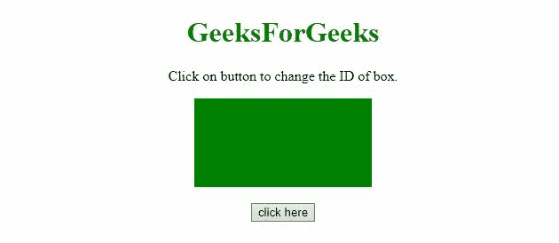

# 如何用 JavaScript 更改元素的 ID？

> 原文:[https://www . geesforgeks . org/如何使用 javascript 更改元素 id/](https://www.geeksforgeeks.org/how-to-change-the-id-of-element-using-javascript/)

给定一个 HTML 文档，任务是使用 JavaScript 更改元素的标识。下面讨论两种方法:

**方法 1:** 我们可以使用 [**id 属性**](https://www.geeksforgeeks.org/html-dom-id-property/) 使用 JavaScript 更改 id。

*   **例:**

    ```html
    <!DOCTYPE HTML>
    <html>

    <head>
        <title>
            Change the ID of the element
            using pure JavaScript
        </title>

        <style>
            .div {
                height: 100px;
                width: 200px;
                margin: 0 auto;
                color: white;
            }

            #div1 {
                background: green;
            }

            #div2 {
                background: blue;
            }
        </style>
    </head>

    <body style="text-align:center;">

        <h1 style="color:green;">
            GeeksForGeeks
        </h1>

        <p id="GFG_UP"></p>

        <div class="div" id="div1"></div>
        <br>

        <button onClick="GFG_Fun()">
            click here
        </button>

        <script>
            var el_up = document.getElementById('GFG_UP');
            el_up.innerHTML = "Click on button to "
                            + "change the ID of box.";

            function GFG_Fun() {
                document.getElementById('div1').id = 'div2';
            }
        </script>
    </body>

    </html>
    ```

*   **输出:**
    

**方法 2:** 我们可以使用元素内部的 [**id 属性**](https://www.geeksforgeeks.org/html-dom-id-property/) 来使用 JavaScript 更改 id。

*   **例:**

    ```html
    <!DOCTYPE HTML>
    <html>

    <head>
        <title>
            Change the ID of the element
            using pure JavaScript
        </title>

        <style>
            .div {
                height: 100px;
                width: 200px;
                margin: 0 auto;
                color: white;
            }

            #div1 {
                background: green;
            }

            #div2 {
                background: blue;
            }
        </style>
    </head>

    <body style="text-align:center;">

        <h1 style="color:green;">
            GeeksForGeeks
        </h1>

        <p id="GFG_UP"></p>

        <div class="div" id="div1"></div>
        <br>

        <button onclick="document.getElementById(
            'div1').id = 'div2'; return false">
            click here
        </button>

        <script>
            var el_up = 
                document.getElementById('GFG_UP');

            el_up.innerHTML = "Click on button to"
                        + " change the ID of box.";
        </script>
    </body>

    </html>
    ```

*   **输出:**
    