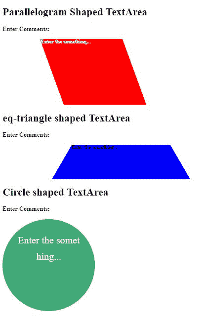
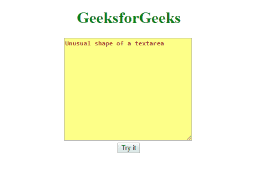
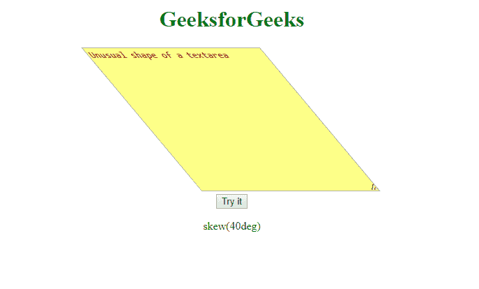

# 如何用 JavaScript 改变一个文本区域的形状？

> 原文:[https://www . geesforgeks . org/如何使用 javascript 更改文本区域的形状/](https://www.geeksforgeeks.org/how-to-change-the-shape-of-a-textarea-using-javascript/)

一般来说，文本区域将是矩形或正方形的形状，但这里我们将处理文本区域的异常形状，这意味着这个文本区域将不是规则的形状，而是可编辑的。

*   **Method 1:**
    In the first method, let’s see the irregular editable textarea created using CSS-shapes and content editable attribute when it is true.

    **程序 1:**

    ```
    <!DOCTYPE html>
    <html>

    <head>
        <style>
            div {
                top: 124px;
                margin-left: 150px;
                outline: none;
            }

            #parallelogram {
                color: white;
                font-weight: bold;
                width: 250px;
                height: 200px;
                transform: skew(20deg);
                background: #f00;
                overflow: hidden;
            }

            #eq-triangle {
                width: 300px;
                height: 0;
                border-bottom: 104px solid blue;
                /* 104 = 120 * 0.866 */
                border-left: 60px solid transparent;
                border-right: 60px solid transparent;
            }

            .circle {
                display: table-cell;
                padding: 40px;
                width: 200px;
                height: 200px;
                border-radius: 50%;
                font-size: 30px;
                color: #fff;
                line-height: 50px;
                text-align: center;
                background: #40a977;
                word-break: break-all;
                justify-content: center;
                overflow: hidden;
            }
        </style>
    </head>

    <body>
        <h1>Parallelogram Shaped TextArea</h1>
        <label>
            <h3>Enter Comments:</h3></label>

        <div id="parallelogram" 
             contenteditable="true">
          Enter the something...
      </div>

        <h1>eq-triangle shaped TextArea</h1>
        <label>
            <h3>Enter Comments:</h3></label>

        <div id="eq-triangle"
             contenteditable="true">
          Enter the something...
      </div>

        <h1>Circle shaped TextArea</h1>
        <label>
            <h3>Enter Comments:</h3></label>

        <div class="circle" 
             contenteditable="true">
          Enter the something...
      </div>

    </body>

    </html>
    ```

    **输出:**
    

*   **Method 2:**
    Change the shape of textarea using JavaScript. First get the element using id and then change the shape using **style.transform = “skew(40deg)”;**.

    **程序 2:** 让我们用 javascript 创建一个不寻常的文本区。

    ```
    <!DOCTYPE html>
    <html>

    <head>
        <style>
            textarea {
                color: brown;
                font-weight: bold;
                width: 250px;
                height: 200px;
                background: #ff7;
                overflow: hidden;
            }
        </style>
    </head>

    <body>
        <center>
            <h1 style="color:green">
              GeeksforGeeks
          </h1>
            <textarea id="myP">
              Unusual shape of a textarea
          </textarea>
            <br>
            <button onclick="myFunction()">
              Try it
          </button>

            <p id="demo"></p>

            <script>
                function myFunction() {
                    var x = document.getElementById(
                      "myP").style.transform = "skew(40deg)";
                    document.getElementById("demo").innerHTML = x;
                }
            </script>
        </center>
    </body>

    </html>
    ```

    **输出:**
    **前:**
    
    **后:**
    