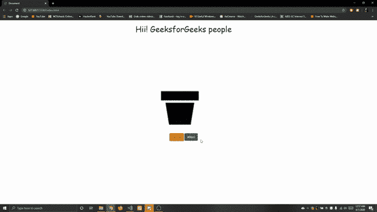

# 只需点击一个按钮，如何在 JavaScript 中改变文字和图像？

> 原文:[https://www . geesforgeks . org/如何通过单击 javascript 中的按钮来更改文本和图像/](https://www.geeksforgeeks.org/how-to-change-the-text-and-image-by-just-clicking-a-button-in-javascript/)

通过使用 javascript 函数，然后单击按钮调用函数，可以更改图像和文本。我们将把它分成 3 个部分。，在第一部分中，我们将仅使用 [**HTML**](https://www.geeksforgeeks.org/html-tutorials/) 来创建结构，在第二部分中，我们将通过使用简单的 [**CSS**](https://www.geeksforgeeks.org/css-tutorials/) 来最小化设计以使其具有吸引力，在第三部分中，我们将添加 [**JavaScript**](https://www.geeksforgeeks.org/javascript-tutorial/) 代码来执行任务

*   **HTML 代码:**在这一部分我们创建了结构加上我们将添加 [**Bootstrap**](https://www.geeksforgeeks.org/bootstrap-tutorials/) cdn 链接为按钮设计和字体。

## 超文本标记语言

```html
<!DOCTYPE html>
<html lang="en">
   <head>
      <meta charset="UTF-8">
      <meta name="viewport"
            content="width=device-width, initial-scale=1.0">
      <link rel="stylesheet" href=
"https://stackpath.bootstrapcdn.com/bootstrap/4.5.0/css/bootstrap.min.css">
   </head>
   <body>
      <div class="container">
         <div class="row">
            <div class="col-md-3"></div>
            <div class="col-md-6">
               <h1 id="message">
                   Hii! GeeksforGeeks people
               </h1>
               
            </div>
            <div class="col-md-3"></div>
         </div>
      </div>
      <div class="button">
         <button class="btn btn-warning"
                 onclick=before();>
             Before
         </button>
         <button  class="btn btn-success"
                  onclick=afterr();>
             Afterr
         </button>
      </div>
   </body>
</html>
```

*   **CSS 代码:**在本节中，我们将使用一些基本的 CSS 样式，使其看起来尽可能正常。

## 半铸钢ˌ钢性铸铁(Cast Semi-Steel)

```html
<style>
    img{
    height: 500px;
    width: 450px;
    }
    h1{
    color: darkgreen;
    margin-top: 20px;
    font-family: Comic Sans MS, cursive, sans-serif;
    }
    .button{
    margin-left: 45%;
    }
</style>
```

*   **Javascript 代码:**在本节中，我们将定义 Javascript 函数，我们拍摄了两张图像，它们出现在单独的“img”文件夹中。

## java 描述语言

```html
<script>
    function before(){
        document.getElementById('myImage')
        .src="img/photo1.jpg";
        document.getElementById('message')
        .innerHTML="Hii! GeeksforGeeks people";
    }

    function afterr(){
        document.getElementById('myImage')
        .src="img/photo2.jpg";
        document.getElementById('message')
        .innerHTML="Bye! GeeksforGeeks people";
    }
</script>
```

**完整代码:**是以上 HTMl、CSS、JavaScript 代码的组合。

## 超文本标记语言

```html
<!DOCTYPE html>
<html lang="en">
   <head>
      <meta charset="UTF-8">
      <meta name="viewport"
            content="width=device-width, initial-scale=1.0">
      <link rel="stylesheet" href=
"https://stackpath.bootstrapcdn.com/bootstrap/4.5.0/css/bootstrap.min.css">
      <style>
         img{
         height: 500px;
         width: 450px;
         }
         h1{
         color: darkgreen;
         margin-top: 20px;
         font-family: Comic Sans MS, cursive, sans-serif;
         }
         .button{
         margin-left: 45%;
         }
      </style>
      <script>
         function before(){
             document.getElementById('myImage')
             .src="img/photo1.jpg";
             document.getElementById('message')
             .innerHTML="Hii! GeeksforGeeks people";
         }

         function afterr(){
             document.getElementById('myImage')
             .src="img/photo2.jpg";
             document.getElementById('message')
             .innerHTML="Bye! GeeksforGeeks people";
         }
      </script>
   </head>
   <body>
      <div class="container">
         <div class="row">
            <div class="col-md-3"></div>
            <div class="col-md-6">
               <h1 id="message">
                   Hii! GeeksforGeeks people
               </h1>
               
            </div>
            <div class="col-md-3"></div>
         </div>
      </div>
      <div class="button">
         <button class="btn btn-warning"
                 onclick=before();>
             Before
         </button>
         <button  class="btn btn-success"
                  onclick=afterr();>
             Afterr
         </button>
      </div>
   </body>
</html>
```

**输出:**



CSS 是网页的基础，通过设计网站和网络应用程序用于网页开发。你可以通过以下 [CSS 教程](https://www.geeksforgeeks.org/css-tutorials/)和 [CSS 示例](https://www.geeksforgeeks.org/css-examples/)从头开始学习 CSS。