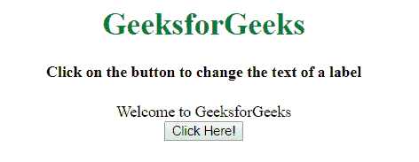
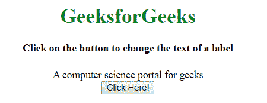

# 如何使用 JavaScript 更改标签的文本？

> 原文:[https://www . geesforgeks . org/如何使用 javascript 更改标签文本/](https://www.geeksforgeeks.org/how-to-change-the-text-of-a-label-using-javascript/)

给定一个 HTML 文档，任务是使用 JavaScript 更改标签的文本。

**什么是标签？**
<标签>标签用于为鼠标用户提供可用性改进，即如果用户点击<标签>元素内的文本，它将切换控件。

**进场:**

*   创建一个标签元素，并为该元素指定一个 **id** 。
*   定义用于调用函数的按钮。它充当开关来更改标签元素中的文本。
*   定义一个 **javaScript** 函数，该函数将更新标签文本。
*   使用 **innerHTML** 属性更改标签内部的文本。**内置 HTML** 属性设置或返回元素的 HTML 内容。

**示例 1:** 该示例实现了上述方法。

```
<!DOCTYPE html>
<html>

<head>
    <title>
        How to change the text of
        a label using JavaScript ?
    </title>
</head>

<body style="text-align:center;">

    <h1 style="color:green;">
        GeeksforGeeks
    </h1>

    <h4>
        Click on the button to change
        the text of a label
    </h4>

    <label id = "GFG">
        Welcome to GeeksforGeeks
    </label>

    <br>

    <button onclick="myGeeks()">
        Click Here!
    </button>

    <script>
        function myGeeks() {
            document.getElementById('GFG').innerHTML
                = 'A computer science portal for geeks';
        }
    </script>
</body>

</html>      
```

**输出:**

*   **之前点击按钮:**
    
*   **点击按钮后:**
    

**示例 2:** 本示例使用 JavaScript 更改标签的文本。

```
<!DOCTYPE html>
<html>

<head>
    <title>
        How to change the text of
        a label using JavaScript ?
    </title>
</head>

<body style="text-align:center;">

    <h1 style="color:green;">
        GeeksforGeeks
    </h1>

    <h4>
        Click on the button to change
        the text of a label
    </h4>

    <label id = "GFG">
        Welcome to GeeksforGeeks
    </label>

    <br>

    <button onclick="myGeeks()">
        Click Here!
    </button>

    <script>
        function myGeeks() {
            var x = document.getElementById("GFG");

            if (x.innerHTML === "Welcome to GeeksforGeeks") {
                x.innerHTML = "A computer science portal for geeks";
            } else {
                x.innerHTML = "Welcome to GeeksforGeeks";
            }
        }
    </script>
</body>

</html>
```

**输出:**

*   **之前点击按钮:**
    
*   **点击按钮后:**
    

JavaScript 最出名的是网页开发，但它也用于各种非浏览器环境。您可以通过以下 [JavaScript 教程](https://www.geeksforgeeks.org/javascript-tutorial/)和 [JavaScript 示例](https://www.geeksforgeeks.org/javascript-examples/)从头开始学习 JavaScript。