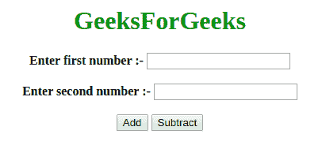
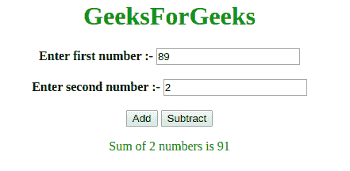
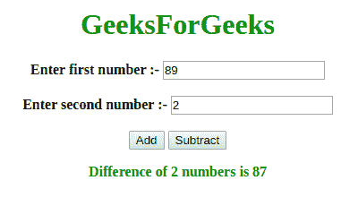

# 如何用 JavaScript 改变函数内部全局变量的值？

> 原文:[https://www . geesforgeks . org/如何使用 javascript 更改函数内部全局变量的值/](https://www.geeksforgeeks.org/how-to-change-the-value-of-a-global-variable-inside-of-a-function-using-javascript/)

**先决条件:**[JavaScript 中的全局和局部变量](https://www.geeksforgeeks.org/global-and-local-variables-in-javascript/)

**局部作用域:**在函数内部声明的变量称为局部变量，这些变量只能在函数内部访问。当函数完成时，局部变量被删除。

**全局作用域:**可以从函数内外访问全局变量。当浏览器窗口关闭时，它们会被删除，但对同一窗口中加载的其他页面可用。有两种方法可以全局声明变量:

*   在函数外声明一个变量。
*   为函数内部的变量赋值，而不使用“var”关键字声明它。

```
<!DOCTYPE html>
<html>

<head>
    <title>
        How to change the value of a global
        variable inside of a function using
        JavaScript?
    </title>

    <script>

        // Declare global variables
        var globalFirstNum1 = 9;
        var globalSecondNum1 = 8;

        function add() {

            // Access and change globalFirstNum1 and globalSecondNum1
            globalFirstNum1 = Number(document.getElementById("fNum").value);
            globalSecondNum1 = Number(document.getElementById("sNum").value);

            // Add local variables
            var result = globalFirstNum1 + globalSecondNum1;

            var output = "Sum of 2 numbers is " + result;

            // Display result
            document.getElementById("result").innerHTML = output;
    }
            // Declare global variables
            globalFirstNum2 = 8;
            globalSecondNum2 = 9;

        function subtract() {
               // Access and change globalFirstNum2
            // and globalSecondNum2

                globalFirstNum2 = Number(document.getElementById("fNum").value);
                globalSecondNum2 = Number(document.getElementById("sNum").value);

            // Use global variables to subtract numbers
            var result = globalFirstNum2-globalSecondNum2;

            var output = "Difference of 2 numbers is " + result;
            document.getElementById("result").innerHTML = output;
        }
    </script>
</head>

<body style="text-align:center;">

    <h1 style="color:green">
        GeeksForGeeks
    </h1> 

    <b>Enter first number :- </b> 
    <input type="number" id="fNum"> 

    <br><br> 

    <b>Enter second number :- </b> 
    <input type="number" id="sNum"> 

    <br><br> 

    <button onclick="add()">Add</button> 
    <button onclick="subtract()">Subtract</button>

    <p id="result" style = "color:green; font-weight:bold;">
    </p>
</body>

</html>
```

**输出:**

*   **点击按钮前:**
    
*   **点击添加按钮后:**
    
*   **点击核减按钮后:**
    