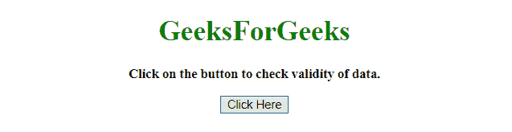
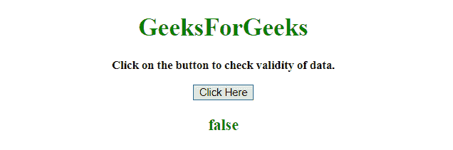
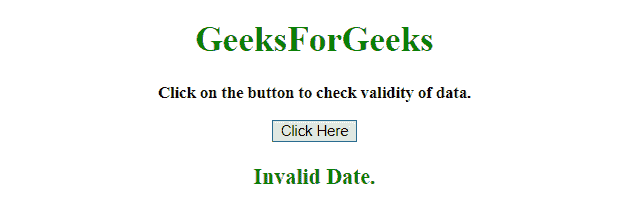

# 如何用 JavaScript 检查日期是否有效？

> 原文:[https://www . geesforgeks . org/如何使用 javascript 检查日期是否有效/](https://www.geeksforgeeks.org/how-to-check-a-date-is-valid-or-not-using-javascript/)

给定一个日期对象，任务是使用 JavaScript 检查给定的日期是否有效。有两种方法可以解决这个问题，讨论如下:

**方法 1:**

*   将日期对象存储在变量中。
*   如果日期有效，那么 **[getTime()](https://www.geeksforgeeks.org/javascript-gettime-method/)** 将始终等于它自己。
*   如果日期无效，那么 **[getTime()](https://www.geeksforgeeks.org/javascript-gettime-method/)** 将返回不等于自身的 NaN。
*   **isValid()函数**用于检查 getTime()方法是否等于自身。

**示例 1:** 该示例实现了上述方法。

```
<!DOCTYPE HTML> 
<html> 

<head> 
    <title> 
        How to check a date is valid
        or not using JavaScript ?
    </title>
</head> 

<body style = "text-align:center;"> 

    <h1 style = "color:green;" > 
        GeeksForGeeks 
    </h1>

    <p id = "GFG_UP" style =
        "font-size: 15px; font-weight: bold;">
    </p>

    <button onclick = "GFG_Fun()">
        Click Here
    </button>

    <p id = "GFG_DOWN" style =
        "color:green; font-size: 20px; font-weight: bold;">
    </p>

    <script>
        var up = document.getElementById('GFG_UP'); 
        var down = document.getElementById('GFG_DOWN'); 
        var d = new Date("2012/2/30");

        up.innerHTML = "Click on the button to check"
                    + " validity of data.<br>";

        Date.prototype.isValid = function () {

            // If the date object is invalid it
            // will return 'NaN' on getTime() 
            // and NaN is never equal to itself.
            return this.getTime() === this.getTime();
        };

        function GFG_Fun() {
            down.innerHTML = d.isValid();
        } 
    </script> 
</body> 

</html>
```

**输出:**

*   **点击按钮前:**
    
*   **点击按钮后:**
    

**方法 2:**

*   将日期对象存储到变量 **d** 中。
*   使用**object . prototype . tostring . call(d)**方法检查变量 **d** 是否由 Date 对象创建。
*   如果日期有效，那么 **[getTime()](https://www.geeksforgeeks.org/javascript-gettime-method/) 方法**将始终等于其本身。
*   如果日期无效，那么 **[getTime()](https://www.geeksforgeeks.org/javascript-gettime-method/) 方法**将返回不等于自身的 NaN。
*   在本例中， **isValid()方法**正在检查 **[getTime()](https://www.geeksforgeeks.org/javascript-gettime-method/)** 是否等于自身。

**示例 2:** 该示例实现了上述方法。

```
<!DOCTYPE HTML> 
<html> 

<head> 
    <title> 
        How to check a date is valid
        or not using JavaScript ?
    </title>
</head> 

<body style = "text-align:center;"> 

    <h1 style = "color:green;" > 
        GeeksForGeeks 
    </h1>

    <p id = "GFG_UP" style =
        "font-size: 15px; font-weight: bold;">
    </p>

    <button onclick = "GFG_Fun()">
        Click Here
    </button>

    <p id = "GFG_DOWN" style =
        "color:green; font-size: 20px; font-weight: bold;">
    </p>

    <script>
        var up = document.getElementById('GFG_UP'); 
        var down = document.getElementById('GFG_DOWN'); 
        var d = new Date("This is not date.");

        up.innerHTML = "Click on the button to check "
                    + "validity of data.<br>";

        function GFG_Fun() {

            if (Object.prototype.toString.call(d)
                                    === "[object Date]")
            {
                if (isNaN(d.getTime())) { 
                    down.innerHTML = "Invalid Date.";
                }
                else {
                    down.innerHTML = "Valid Date.";
                }
            }
        } 
    </script> 
</body> 

</html>
```

**输出:**

*   **点击按钮前:**
    
*   **点击按钮后:**
    

JavaScript 最出名的是网页开发，但它也用于各种非浏览器环境。您可以通过以下 [JavaScript 教程](https://www.geeksforgeeks.org/javascript-tutorial/)和 [JavaScript 示例](https://www.geeksforgeeks.org/javascript-examples/)从头开始学习 JavaScript。