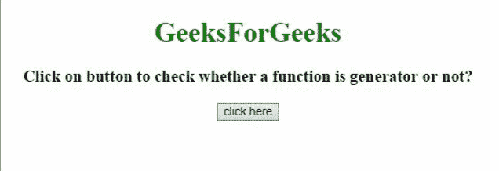

# 如何用 JavaScript 检查一个函数是不是生成器函数？

> 原文:[https://www . geesforgeks . org/如何检查一个函数是一个生成器函数还是不使用 javascript/](https://www.geeksforgeeks.org/how-to-check-a-function-is-a-generator-function-or-not-using-javascript/)

给定一个包含一些 JavaScript 函数的 HTML 文档，任务是在 JavaScript 的帮助下检查给定的函数是否是生成器函数。下面讨论两个解决这个问题的例子:

**示例 1:** 在本例中，我们将使用**function name . constructor . name 属性**。它的 functionName.constructor.name 属性值等于**“generator function”**，那么给定的函数就是生成器函数。

```
<!DOCTYPE HTML> 
<html> 

<head> 
    <title> 
        Check whether a given function is a
        generator function or not in JavaScript
    </title>
</head> 

<body style="text-align:center;">

    <h1 style="color:green;"> 
        GeeksForGeeks 
    </h1> 

    <p style=
        "font-size: 19px; font-weight: bold;">
        Click on button to check whether a 
        function is generator or not? 
    </p>

    <button onClick="GFG_Fun()"> 
        click here 
    </button> 

    <p id="GFG" style="color: green; 
        font-size: 24px; font-weight: bold;"> 
    </p>

    <script> 
        var gfg = document.getElementById('GFG'); 

        function * generatorFunction() { 
            yield 10; 
            yield 30;     
        } 
        function isGenerator(fn) {
            return fn.constructor.name === 'GeneratorFunction';
        }
        function GFG_Fun() {
            gfg.innerHTML = isGenerator(generatorFunction);
        } 
    </script> 
</body>

</html>
```

**输出:**


**示例 2:** 在本例中，我们将使用运算符的**实例。首先定义生成器函数，然后检查 instanceof 运算符返回的值是否等于生成器函数。**

```
<!DOCTYPE HTML> 
<html> 

<head> 
    <title> 
        Check whether a given function is a
        generator function or not in JavaScript
    </title>
</head> 

<body style="text-align:center;">

    <h1 style="color:green;"> 
        GeeksForGeeks 
    </h1> 

    <p style=
        "font-size: 19px; font-weight: bold;">
        Click on button to check whether a 
        function is generator or not? 
    </p>

    <button onClick="GFG_Fun()"> 
        click here 
    </button> 

    <p id="GFG" style="color: green; 
        font-size: 24px; font-weight: bold;"> 
    </p>

    <script> 
        var gfg = document.getElementById('GFG'); 

        function *genFun() { 
            yield 10; 
            yield 30;     
        }

        function GFG_Fun() {
            var GeneratorFunction = (function*(){
                yield undefined;
            }).constructor;

            gfg.innerHTML = 
                genFun instanceof GeneratorFunction;
        } 
    </script> 
</body>

</html>
```

**输出:**
