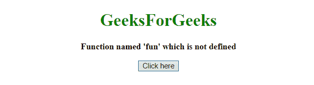
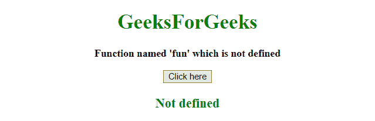
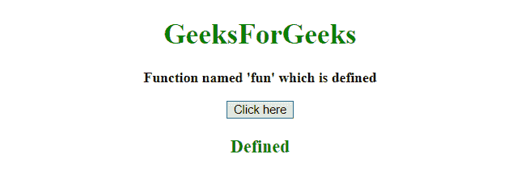

# 如何检查一个函数是否在 JavaScript 中定义？

> 原文:[https://www . geesforgeks . org/如何在 javascript 中检查函数定义/](https://www.geeksforgeeks.org/how-to-check-a-function-is-defined-in-javascript/)

工作是识别一个函数是否被定义。JavaScript 类型的运算符用于解决下面描述的问题:

**运算符的 JavaScript 类型:**该运算符可用于查找 Javascript 变量的类型。此运算符返回变量或表达式的类型:

**语法:**

```
typeof var
```

**参数:**包含单值 **var** ，这是一个 Javascript 变量。

**返回值:**返回变量或表达式的类型:

**示例 1:** 本示例检查函数的类型，如果是函数，则使用**类型的运算符**对其进行定义。

```
<!DOCTYPE HTML> 
<html> 
    <head> 
        <title> 
            How to check a function is defined
        </title>
    </head> 

    <body style = "text-align:center;"> 

        <h1 style = "color:green;" > 
            GeeksForGeeks 
        </h1> 

        <p id = "GFG_UP" style = "font-size: 16px; font-weight: bold;">
        </p>

        <button onclick = "gfg_Run()"> 
            Click here
        </button>

        <p id = "GFG_DOWN" style = 
            "color:green; font-size: 20px; font-weight: bold;">
        </p>

        <script>
            var el_up = document.getElementById("GFG_UP");
            var el_down = document.getElementById("GFG_DOWN");

            el_up.innerHTML = 
                "Function named 'fun' which is not defined";

            function gfg_Run() {
                var defined = 'Not defined';
                if(typeof fun == 'function') {
                    defined = "Defined";
                }
                el_down.innerHTML = defined;
            }         
        </script> 
    </body> 
</html>                    
```

**输出:**

*   **点击按钮前:**
    
*   **点击按钮后:**
    

**示例 2:** 本示例检查函数的类型，如果是函数，则通过创建函数使用**类型的运算符**来定义，否则无法定义。

```
<!DOCTYPE HTML> 
<html> 
    <head> 
        <title> 
            How to check a function is defined
        </title>
    </head> 

    <body style = "text-align:center;"> 

        <h1 style = "color:green;" > 
            GeeksForGeeks 
        </h1> 

        <p id = "GFG_UP" style = "font-size: 16px; font-weight: bold;">
        </p>

        <button onclick = "gfg_Run()"> 
            Click here
        </button>

        <p id = "GFG_DOWN" style = 
            "color:green; font-size: 20px; font-weight: bold;">
        </p>

        <script>
            var el_up = document.getElementById("GFG_UP");
            var el_down = document.getElementById("GFG_DOWN");

            el_up.innerHTML = "Function named 'fun' which is defined";

            function isFunction(possibleFunction) {
                return typeof(possibleFunction) === typeof(Function);
            }

            function fun() {

            }

            function gfg_Run() {
                var defined = 'Not defined';
                if(isFunction(fun)) {
                    defined = "Defined";
                }
                el_down.innerHTML = defined;
            }         
        </script> 
    </body> 
</html>                    
```

**输出:**

*   **点击按钮前:**
    
*   **After clicking on the button:**
    

    <