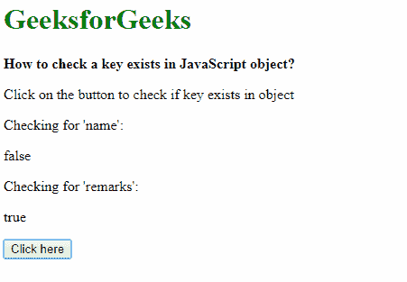
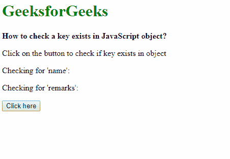

# 如何检查 JavaScript 对象中是否存在一个键？

> 原文:[https://www . geesforgeks . org/如何检查 javascript 对象中存在的密钥/](https://www.geeksforgeeks.org/how-to-check-a-key-exists-in-javascript-object/)

主要有两种方法来检查 JavaScript 对象中是否存在密钥。第一种是在操作符中使用[，第二种是使用](https://www.geeksforgeeks.org/javascript-in-operator/)[“hasown property()方法”](https://www.geeksforgeeks.org/javascript-hasownproperty-method/)。

**方法 1:使用“in”运算符:**如果指定的属性在对象中，in 运算符将返回一个布尔值。

**语法:**

```
propertyName in object
```

**示例:**本示例使用“in”运算符检查 JavaScript 对象中键的存在。

```
<!DOCTYPE html>
<html>

<head>
    <title>
        How to check a key exists in
        JavaScript object?
    </title>
</head>

<body>
    <h1 style="color: green">
        GeeksforGeeks
    </h1>

    <b>
        How to check a key exists
        in JavaScript object?
    </b>

    <p>
        Click on the button to check
        if key exists in object
    </p>

    Checking for 'name': <p class="output1"></p>
    Checking for 'remarks': <p class="output2"></p>

    <button onclick="checkKey()">
        Click here
    </button>

    <script type="text/javascript">
        function checkKey() {

            // Define an object
            exampleObj = {
                id: 1,
                remarks: 'Good'
            }

            // Check for the keys
            output1 = 'name' in exampleObj;
            output2 = 'remarks' in exampleObj;

            document.querySelector('.output1').innerHTML
                    = output1;

            document.querySelector('.output2').innerHTML
                    = output2;
        }
    </script>
</body>

</html>                    
```

**输出:**

*   **点击按钮前:**
    
*   **点击按钮后:**
    

**方法 2:使用 hasOwnProperty()方法:**hasown property()方法返回一个布尔值，该值指示对象是否具有指定的属性。可以在此函数中传递所需的键名，以检查它是否存在于对象中。

**语法:**

```
object.hasOwnProperty(propertyName)
```

**示例:**本示例使用 hasOwnProperty()方法检查 JavaScript 对象中键的存在。

```
<!DOCTYPE html>
<html>

<head>
    <title>
        How to check a key exists
        in JavaScript object?
    </title>
</head>

<body>
    <h1 style="color: green">
        GeeksforGeeks
    </h1>

    <b>
        How to check a key exists
        in JavaScript object?
    </b>

    <p>
        Click on the button to check
        if key exists in object
    </p>

    Checking for 'name': <p class="output1"></p>
    Checking for 'remarks': <p class="output2"></p>

    <button onclick="checkKey()">
        Click here
    </button>

    <script type="text/javascript">
        function checkKey() {

            // Define an object
            exampleObj = {
                id: 1,
                remarks: 'Good'
            }

            // Check for the keys
            output1 = exampleObj.hasOwnProperty('name');
            output2 = exampleObj.hasOwnProperty('remarks');

            document.querySelector('.output1').innerHTML
                    = output1;

            document.querySelector('.output2').innerHTML
                    = output2;
        }
    </script>
</body>

</html>                    
```

**输出:**

*   **点击按钮前:**
    
*   **点击按钮后:**
    

JavaScript 最出名的是网页开发，但它也用于各种非浏览器环境。您可以通过以下 [JavaScript 教程](https://www.geeksforgeeks.org/javascript-tutorial/)和 [JavaScript 示例](https://www.geeksforgeeks.org/javascript-examples/)从头开始学习 JavaScript。