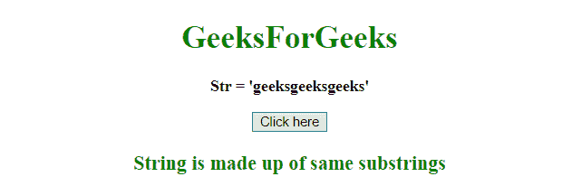
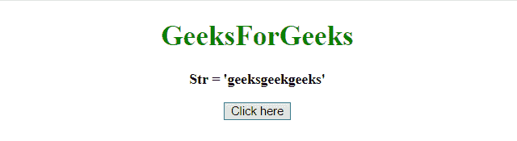
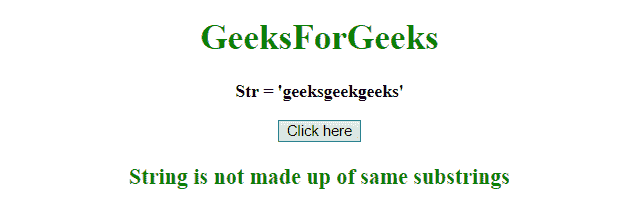

# 如何检查一个字符串在 JavaScript 中完全是由同一个子串组成的？

> 原文:[https://www . geesforgeks . org/如何检查字符串完全由相同的 javascript 子字符串组成/](https://www.geeksforgeeks.org/how-to-check-a-string-is-entirely-made-up-of-the-same-substring-in-javascript/)

给定一个字符串，任务是确定该字符串是否由相同的子字符串组成。

**进场:**

*   将字符串初始化为变量。
*   使用 test()方法测试字符串中的模式。
*   如果找到匹配项，test()方法返回 true，否则返回 false。

**示例 1:** 本示例检查由相同子字符串组成的字符串**极客**，因此返回 True。

```
<!DOCTYPE HTML> 
<html> 
    <head> 
        <title> 
            How to check a string is entirely
            made of same substring ?
        </title>
    </head> 

    <body style = "text-align:center;"> 

        <h1 style = "color:green;" > 
            GeeksForGeeks 
        </h1> 

        <p id = "GFG_UP" style =
            "font-size: 16px; font-weight: bold;">     
        </p>

        <button onclick = "gfg_Run()"> 
            Click here
        </button>

        <p id = "GFG_DOWN" style =
            "color:green; font-size: 20px; font-weight: bold;">
        </p>

        <script>
            var el_up = document.getElementById("GFG_UP");
            var el_down = document.getElementById("GFG_DOWN");

            var str = "geeksgeeksgeeks";

            el_up.innerHTML = "Str = '" + str + "'";
            function check(str) {
                return /^(.+)\1+$/.test(str)
            }

            function gfg_Run() {
                ans = "String is not made up of same substrings";
                if (check(str)) {
                    ans = "String is made up of same substrings"; 
                }
                el_down.innerHTML = ans;
            }         
        </script> 
    </body> 
</html>                    
```

**输出:**

*   **点击按钮前:**
    
*   **点击按钮后:**
    

**示例 2:** 本示例检查字符串 **geeksgeekgeeks** ，它不是由相同的子字符串组成的，因此它返回 False。

```
<!DOCTYPE HTML> 
<html> 
    <head> 
        <title> 
            How to check a string is entirely
            made of same substring ?
        </title>
    </head> 

    <body style = "text-align:center;"> 

        <h1 style = "color:green;" > 
            GeeksForGeeks 
        </h1> 

        <p id = "GFG_UP" style =
            "font-size: 16px; font-weight: bold;">     
        </p>

        <button onclick = "gfg_Run()"> 
            Click here
        </button>

        <p id = "GFG_DOWN" style =
            "color:green; font-size: 20px; font-weight: bold;">
        </p>

        <script>
            var el_up = document.getElementById("GFG_UP");
            var el_down = document.getElementById("GFG_DOWN");

            var str = "geeksgeekgeeks";

            el_up.innerHTML = "Str = '" + str + "'";
            function check(str) {
                return /^(.+)\1+$/.test(str)
            }

            function gfg_Run() {
                ans = "String is not made up of same substrings";
                if (check(str)) {
                    ans = "String is made up of same substrings"; 
                }
                el_down.innerHTML = ans;
            }         
        </script> 
    </body> 
</html>                    
```

**输出:**

*   **点击按钮前:**
    
*   **点击按钮后:**
    