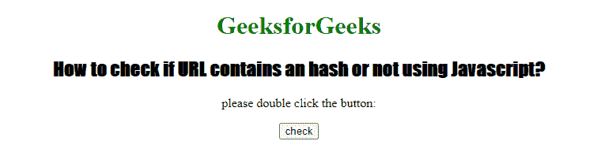
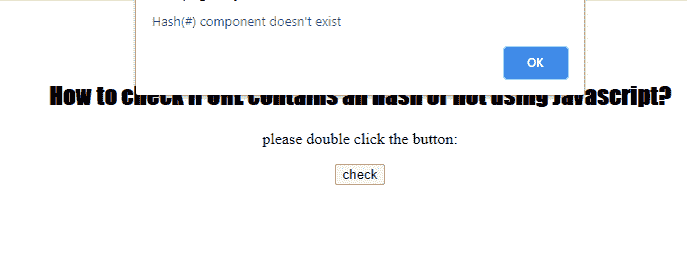

# 如何用 JavaScript 检查一个 URL 是否包含哈希？

> 原文:[https://www . geeksforgeeks . org/如何检查 URL-包含一个哈希或不使用 javascript/](https://www.geeksforgeeks.org/how-to-check-a-url-contains-a-hash-or-not-using-javascript/)

任务是检查一个网址是否包含。这可以通过在 JavaScript 中使用 Location hash 属性来实现。它返回一个字符串，该字符串表示包含哈希符号“#”的 URL 的锚定部分。

**语法:**

```html
window.location.hash
```

**示例:**

## 超文本标记语言

```html
<!DOCTYPE html>
<html>

<body style="text-align: center">

    <h1 style="color: green;">
        GeeksforGeeks
    </h1>

    <h2 style="font-family: Impact;">
        How to check if URL contains an 
        hash or not using Javascript?
    </h2>

    <p>
        please double click the button:
    </p>

    <button ondblclick="mylocation()">
        check
    </button>

    <p id="hash"></p>

    <script>
        function mylocation() {
            if (window.location.hash) {
                alert("Hash(#) component exists");
            }
            else {
                alert("Hash(#) component doesn't exist");
            }
        } 
    </script>
</body>

</html>
```

**输出:**

**点击按钮前:**



**点击按钮后:**



**支持的浏览器:**

*   谷歌 Chrome
*   微软公司出品的 web 浏览器
*   火狐浏览器
*   旅行队
*   歌剧