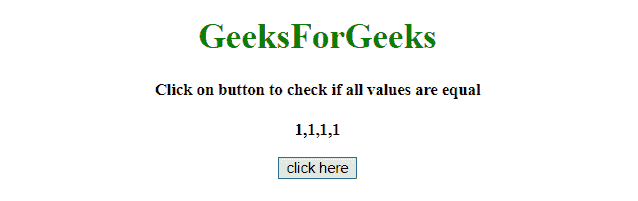
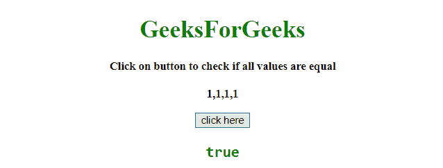
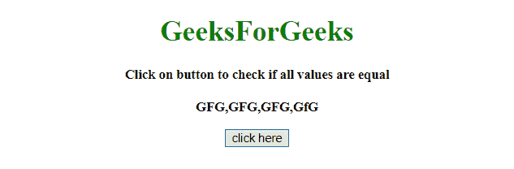
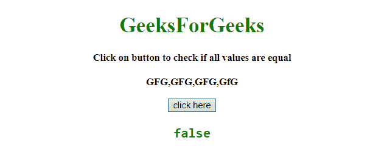

# 如何在 JavaScript 中检查一个数组的所有值是否相等？

> 原文:[https://www . geesforgeks . org/如何在 javascript 中检查数组的所有值是否相等/](https://www.geeksforgeeks.org/how-to-check-all-values-of-an-array-are-equal-or-not-in-javascript/)

给定一个 javaScript 数组，如果使用 javaScript 数组的所有值都相同，则任务是打印 true。

**方法 1:**

*   首先获取元素数组。
*   将其传递给 arrow 函数，该函数对每个数组元素调用 every()方法，如果每个元素与数组的第一个元素匹配，则返回 true。

**示例 1:** 本示例使用 **array.every()方法**打印所需响应。

```
<!DOCTYPE HTML> 
<html> 
    <head> 
        <title> 
            Check if all values of array are
            equal using JavaScript functions
        </title>
    </head> 

    <body style = "text-align:center;"> 

        <h1 style = "color:green;" > 
            GeeksForGeeks 
        </h1>

        <p id = "GFG_UP" style =
            "font-size: 15px; font-weight: bold;">
        </p>

        <button onclick = "gfg_Run();">
            click here
        </button>

        <pre id = "GFG_DOWN" style =
            "color:green; font-size: 20px; font-weight: bold;">
        </pre>

        <script>
            var el_up = document.getElementById("GFG_UP");
            var el_down = document.getElementById("GFG_DOWN");

            var arr = [1, 1, 1, 1];

            el_up.innerHTML = 
            "Click on button to check if all values are"
                    + " equal<br><br>" + arr;

            const allEqual = 
                    arr => arr.every( v => v === arr[0] );

            function gfg_Run() {
                el_down.innerHTML = allEqual(arr);
            }         
        </script> 
    </body> 
</html>
```

**输出:**

*   **点击按钮前:**
    
*   **点击按钮后:**
    

**方法 2:**

*   首先获取元素数组。
*   将它传递给一个函数，该函数对数组元素调用 reduce()方法。
*   如果每个元素都与数组的第一个元素匹配，则返回 true。

**示例:**本示例使用 **array.reduce()方法**打印给定数组的 false。

```
<!DOCTYPE HTML> 
<html> 
    <head> 
        <title> 
            Check if all values of array are 
            equal using JavaScript functions
        </title>
    </head> 

    <body style = "text-align:center;">

        <h1 style = "color:green;" > 
            GeeksForGeeks 
        </h1>

        <p id = "GFG_UP" style = 
            "font-size: 15px; font-weight: bold;">
        </p>

        <button onclick = "gfg_Run();">
            click here
        </button>

        <pre id = "GFG_DOWN" style =
            "color:green; font-size: 20px; font-weight: bold;">
        </pre>

        <script>
            var el_up = document.getElementById("GFG_UP");
            var el_down = document.getElementById("GFG_DOWN");

            var arr = ["GFG", "GFG", "GFG", "GfG"];

            el_up.innerHTML = "Click on button to check if all"
                    + " values are equal<br><br>" + arr;

            function allEqual(arr) {
                if(!arr.length) return true;
                return arr.reduce(function(a, b)
                    {return (a === b)?a:(!b);}) === arr[0];
            }        

            function gfg_Run() {
                el_down.innerHTML = allEqual(arr);
            }         
        </script> 
    </body> 
</html>                    
```

**输出:**

*   **点击按钮前:**
    
*   **点击按钮后:**
    