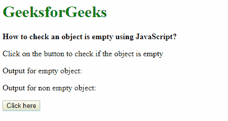
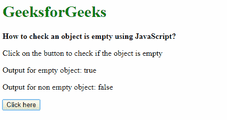

# 如何用 JavaScript 检查一个对象是否为空？

> 原文:[https://www . geesforgeks . org/如何使用 javascript 检查对象是否为空/](https://www.geeksforgeeks.org/how-to-check-an-object-is-empty-using-javascript/)

**方法 1:使用 Object.keys(对象)方法:**所需的对象可以传递给 Object.keys(对象)方法，该方法将返回对象中的键。length 属性用于检查键的数量。如果 length 属性返回 0 个键，则表示对象为空。

**语法:**

```
Object.keys(object).length === 0
```

**示例:**

```
<!DOCTYPE html>
<html>

<head>
    <title>
        How to check an object is 
        empty using JavaScript?
    </title>
</head>

<body>
    <h1 style="color: green">
        GeeksforGeeks
    </h1>

    <b>
        How to check an object is
        empty using JavaScript?
    </b>

    <p>
        Click on the button to check
        if the object is empty
    </p>

    <p>Output for empty object: 
        <span class="outputEmpty"></span>
    </p>

    <p>Output for non empty object: 
        <span class="outputNonEmpty"></span>
    </p>

    <button onclick="checkObject()">
        Click here
    </button>

    <!-- Script to check the object is empty or not -->
    <script type="text/javascript">
        function checkObject() {

            let emptyObj = {}
            let nonEmptyObj = {
                title: 'Title 1',
                info: 'Sample Info'
            }

            ans1 = (Object.keys(emptyObj).length === 0)
            document.querySelector('.outputEmpty').textContent
                    = ans1;

            ans2 = (Object.keys(nonEmptyObj).length === 0)
            document.querySelector('.outputNonEmpty').textContent
                    = ans2;
        }
    </script>
</body>

</html>                    
```

**输出:**

*   **点击按钮前:**
    
*   **点击按钮后:**
    

**方法 2:使用 object.hasOwnProperty(键)循环遍历对象:**创建一个函数，在该函数中，使用 object.hasOwnProperty()方法循环遍历对象并检查它是否包含“键”属性。如果该函数在循环中找不到任何键，则该函数将返回 true，这意味着该对象为空。如果遇到任何键，循环中断并返回 false。此方法也适用于可能不支持第一种方法的旧浏览器。

**语法:**

```
function isEmptyObj(object) {
    for (var key in object) {
        if (object.hasOwnProperty(key)) {
            return false;
        }
    }
}

```

**示例:**

```
<!DOCTYPE html>
<html>

<head>
    <title>
        How to check an object is
        empty using JavaScript?
    </title>
</head>

<body>
    <h1 style="color: green">
        GeeksforGeeks
    </h1>

    <b>
        How to check an object is
        empty using JavaScript?
    </b>

    <p>
         on the button to check
         if the object is empty
    </p>

    <p>
        Output for empty object: 
        <span class="outputEmpty"></span>
    </p>

    <p>
        Output for non empty object: 
        <span class="outputNonEmpty"></span>
    </p>

    <button onclick="checkObject()">
        Click here
    </button>

    <script type="text/javascript">

        function checkObject() {
            let emptyObj = {}
            let nonEmptyObj = {
                title: 'Title 1',
                info: 'Sample Info'
            }

            ans1 = isEmptyObj(emptyObj);
            document.querySelector('.outputEmpty').textContent
                    = ans1;

            ans2 = isEmptyObj(nonEmptyObj);
            document.querySelector('.outputNonEmpty').textContent
                    = ans2;
        }

        function isEmptyObj(object) {
            for (var key in object) {
                if (object.hasOwnProperty(key)) {
                    return false;
                }
            }

            return true;
        }
    </script>
</body>

</html>
```

**输出:**

*   **点击按钮前:**
    
*   **点击按钮后:**
    