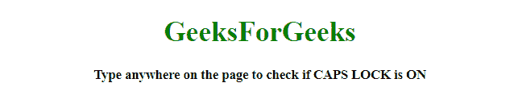
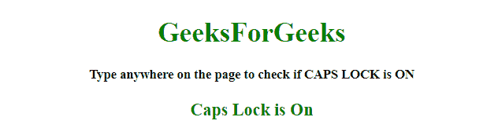
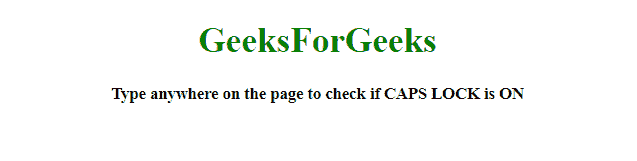
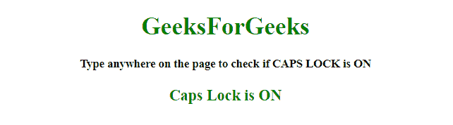
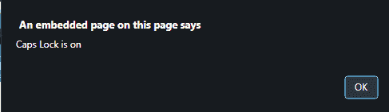

# 如何用 JavaScript / jQuery 检查大写锁定是开/关？

> 原文:[https://www . geesforgeks . org/how-check-caps-lock-is-on-off-use-JavaScript-jquery/](https://www.geeksforgeeks.org/how-to-check-caps-lock-is-on-off-using-javascript-jquery/)

工作是使用 JavaScript 和 jQuery 确定**大写锁定**是**开启**还是**关闭**。

**使用 JavaScript 检查大写锁定是否打开/关闭:**

*   **addEventListener() Method:** This method adds an event handler to the document.

    **语法:**

    ```
    document.addEventListener(event, function, useCapture)

    ```

    **参数:**

    *   **事件:**此参数为必填项。它指定字符串，即事件的名称。
    *   **功能:**此参数为必选项。它指定事件发生时要运行的函数。当事件发生时，事件对象作为第一个参数传递给函数。类型取决于指定的事件。例如，“点击”事件属于 MouseEvent 对象。
    *   **使用捕捉:**此参数是可选的。它指定了一个布尔值，这意味着事件应该在捕获阶段还是在冒泡阶段执行。
        *   **true:** 事件处理程序在捕获阶段执行。
        *   **false:** 事件处理程序在冒泡阶段执行。

**示例 1:** 这个示例向文档中添加了一个事件侦听器，当它发生时，它会调用一个匿名函数来处理这个事件。它通过使用按钮的**键码**来检查它是大写锁定键还是 SHIFT 键。

```
<!DOCTYPE HTML> 
<html> 
    <head> 
        <title> 
            Check caps lock is on or not
        </title>     
    </head> 

    <body style = "text-align:center;">

        <h1 style = "color:green;" > 
            GeeksForGeeks 
        </h1>

        <p id = "GFG_UP" style =
            "font-size: 15px; font-weight: bold;">
        </p>

        <p id = "GFG_DOWN" style = 
            "color:green; font-size: 20px; font-weight: bold;">
        </p>

        <script>
            var up = document.getElementById('GFG_UP');

            up.innerHTML = 
                "Type anywhere on the page to check if CAPS LOCK is ON";

            var down = document.getElementById('GFG_DOWN');     

            document.addEventListener('keypress', function(e) {
                e = (e) ? e : window.event;

                var charCode = false;

                if (e.which) {
                    charCode = e.which;
                } 
                else if (e.keyCode) {
                    charCode = e.keyCode;
                }

                var shifton = false;

                if (e.shiftKey) {
                    shifton = e.shiftKey;
                }
                else if (e.modifiers) {
                    shifton = !!(e.modifiers & 4);
                }
                if (charCode >= 97 && charCode <= 122 && shifton) {
                    down.innerHTML = "Caps Lock is On";
                    return;
                }
                if (charCode >= 65 && charCode <= 90 && !shifton) {
                    down.innerHTML = "Caps Lock is On";
                    return;
                }
                down.innerHTML = "Caps Lock is Off";
                return;
            });     
        </script> 
    </body> 
</html>                    
```

**输出:**

*   **点击文档前:**
    
*   **点击文档后:**
    

**示例 2:** 本示例向文档添加一个事件侦听器，当事件侦听器发生时，它会检查是否按下了 CAPS LOCK。

```
<!DOCTYPE HTML> 
<html> 
    <head> 
        <title> 
            Check caps lock is on or not
        </title>     
    </head> 

    <body style = "text-align:center;">

        <h1 style = "color:green;" > 
            GeeksForGeeks 
        </h1>

        <p id = "GFG_UP" style =
            "font-size: 15px; font-weight: bold;">
        </p>

        <p id = "GFG_DOWN" style = 
            "color:green; font-size: 20px; font-weight: bold;">
        </p>

        <script>
            var up = document.getElementById('GFG_UP');
            up.innerHTML = "Press the CAPS LOCK";
            var down = document.getElementById('GFG_DOWN');     

            document.addEventListener("keyup", function(event) {
                if (event.getModifierState("CapsLock")) {
                    down.innerHTML = "CAPS LOCK is On";
                } else {
                    down.innerHTML = "CAPS LOCK is Off";
                }
            });
        </script> 
    </body> 
</html>                    
```

**输出:**

*   **点击文档前:**
    
*   **点击文档后:**
    

**使用 jQuery 检查大写锁定是否打开/关闭:**

*   **jQuery on() Method:** This method adds one or more event handlers for the selected elements and child elements.

    **语法:**

    ```
    $(selector).on(event, childSelector, data, function, map)
    ```

    **参数:**

    *   **事件:**此参数为必填项。它指定一个或多个要附加到选定元素的事件或命名空间。如果有多个事件值，这些值用空格隔开。事件必须是有效的。
    *   **儿童选择器:**该参数可选。它指定事件处理程序应该只附加到已定义的子元素。
    *   **数据:**此参数为可选。它指定要传递给函数的附加数据。
    *   **功能:**此参数为必选项。它指定事件发生时要运行的函数。
    *   **映射:**它指定了一个事件映射({event:func()，event:func()，…})，该事件映射有一个或多个要添加到所选元素的事件，以及事件发生时要运行的函数。
*   **JavaScript String toUpperCase() Method:** This method converts a string to uppercase letters.

    **语法:**

    ```
    string.toUpperCase()
    ```

    **返回值:**返回一个字符串，代表转换为大写的字符串的值。

*   **JavaScript String toLowerCase() Method:** This method converts a string to lowercase letters.

    **语法:**

    ```
    string.toLowerCase()
    ```

    **返回值:**它返回一个字符串，表示转换为小写的字符串的值。

**示例 1:** 这个示例向文档主体添加了一个事件侦听器，当它发生时，它会调用一个匿名函数来处理这个事件。它通过使用**来检查它是大写锁定键还是移位键，以锁定()和移位键**。

```
<!DOCTYPE HTML> 
<html> 
    <head> 
        <title> 
            Check caps lock is on or not
        </title>

        <script src =
"https://ajax.googleapis.com/ajax/libs/jquery/3.4.0/jquery.min.js">
        </script> 
    </head> 

    <body style = "text-align:center;" id = "body"> 

        <h1 style = "color:green;" > 
            GeeksForGeeks 
        </h1>

        <p id = "GFG_UP" style =
            "font-size: 15px; font-weight: bold;">
        </p>

        <p id = "GFG_DOWN" style =
            "color:green; font-size: 20px; font-weight: bold;">
        </p>

        <script>
            $('#GFG_UP').
            text("Type anywhere on the page to check if CAPS LOCK is ON");

            $("#body").on('keypress', function(e) { 
                var s = String.fromCharCode( e.which );
                if ((s.toUpperCase() === s && s.toLowerCase() !== s 
                    && !e.shiftKey) || (s.toUpperCase() !== s && 
                    s.toLowerCase() === s && e.shiftKey)) {
                        $('#GFG_DOWN').text("Caps Lock is ON");
                    } 
                    else if ((s.toLowerCase() === s && s.toUpperCase() !== s
                    && !e.shiftKey) || (s.toLowerCase() !== s 
                    && s.toUpperCase() === s && e.shiftKey)) { 
                        $('#GFG_DOWN').text("Caps Lock is OFF");
                    } 
            });
        </script> 
    </body> 
</html>                    
```

**输出:**

*   **在文档上打字前:**
    
*   **在文档上键入后:**
    

**示例 2:** 该示例与前一示例的操作相同，但方法不同。向文档中添加一个事件侦听器，当它发生时，它会检查是否按下了大写锁定键。

```
<!DOCTYPE HTML> 
<html> 
    <head> 
        <title> 
            Check caps lock is on or not
        </title>

        <script src = 
"https://ajax.googleapis.com/ajax/libs/jquery/3.4.0/jquery.min.js">
        </script> 
    </head> 

    <body style = "text-align:center;" id = "body"> 

        <h1 style = "color:green;" > 
            GeeksForGeeks 
        </h1>

        <p id = "GFG_UP" style =
            "font-size: 15px; font-weight: bold;">
        </p>

        <p id = "GFG_DOWN" style =
            "color:green; font-size: 20px; font-weight: bold;">
        </p>

        <script>
            $('#GFG_UP').text("Turn On the Caps Lock and type on screen");
            $('#body').on('keypress', function(e) { 
                var s = String.fromCharCode( e.which );
                if ( (s.toUpperCase() === s && !e.shiftKey) || 
                        (s.toLowerCase() === s && e.shiftKey) ) {
                    alert('Caps Lock is on');
                } else {
                    alert('Caps Lock is off');
                }

            });
        </script> 
    </body> 
</html>                    
```

**输出:**

*   **在文档上打字前:**
    
*   **在文档上键入后:**
    