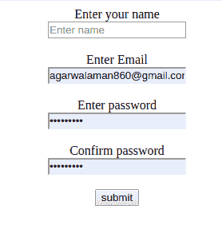
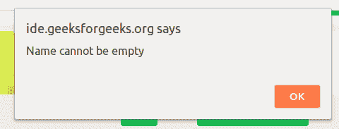

# 如何在 JavaScript 中检查空/未定义/空字符串？

> 原文:[https://www . geesforgeks . org/如何检查-空-未定义-空-javascript 中的字符串/](https://www.geeksforgeeks.org/how-to-check-empty-undefined-null-string-in-javascript/)

如果我们想检查任何字符串，无论它是填充的还是空的，我们都可以使用 Javascript 来实现这样的目的，例如:表单验证。
**例:**

## 超文本标记语言

```
<!DOCTYPE HTML>
<html>

<head>
    <!--function to check that name can not be empty-->
    <script>
        function checkempty(form) {
            if (form.name.value == null ||
                form.name.value == undefined ||
                form.name.value.length == 0) {

                alert("Name cannot be empty\n");
                return false;
            } else {
                alert("Your response has been recorded\n");
                return true;
            }
        }
    </script>
</head>

<body>
    <div>
        <center>
            <form onsubmit="return checkempty(form1)"
                  action="#" method="post"
                  name="form1">
                <label>Enter your name</label>
                <br>
                <input type="string"
                       placeholder="Enter name"
                       name="name" />
                <br>
                <br>
                <label>Enter Email</label>
                <br>
                <input type=""
                       placeholder="Enter email"
                       name="email" />
                <br>
                <br>
                <label>Enter password</label>
                <br>
                <input type="password"
                       placeholder="Enter password "
                       name="password1" />
                <br>
                <br>
                <label>Confirm password</label>
                <br>
                <input type="password"
                       placeholder="Enter password "
                       name="password2" />
                <br>
                <br>
                <input type="submit"
                       value="submit" />
                <br>
            </form>
        </center>
    </div>
</body>

</html>
```

**输出:**
**如果名称为空:**



**提交表格后:**



**用 3 种不同的方法简化:**

**方法-1:使用===运算符**

使用= = = =运算符，我们将检查字符串是否为空。如果为空，则返回“空字符串”，如果字符串不为空，则返回“非空字符串”

## java 描述语言

```
// function to check string is empty or not
function checking(str)
{
// checking the string using === operator
   if (str === "")
   {
       console.log("Empty String")
       }
       else{
       console.log("Not Empty String")
       }
   }

// calling the checking function with empty string
checking("")
// calling the checking function with not an empty string
checking("GeeksforGeeks")
```

> **输出:**
> 
> 空字符串
> 
> 非空字符串

**方法-2:利用长度和！操作员**

这个函数也将通过使用来检查字符串的长度！运算符我们将检查字符串是否为空。

## java 描述语言

```
// function to check string is empty or not
function checking(str)
{
  // checking the string using ! operator and length
  // will return true if empty string and false if string is not empty
    return (!str || str.length === 0 );
}
// calling the checking function with empty string
console.log(checking(""))
// calling the checking function with not an empty string
console.log(checking("GeeksforGeeks"))
```

> **输出:**
> 
> 真实的
> 
> 错误的

**方法-3:使用替换**

它将确保字符串不仅仅是一组空格，我们在这些空格上进行替换。

## java 描述语言

```
// function to check string is empty or not
function checking(str)
{
 if(str.replace(/\s/g,"") == ""){
     console.log("Empty String")
 }
 else
 {
     console.log("Not Empty String")
 }
}

// calling the checking function with empty string
checking("  ")
// calling the checking function with not an empty string
checking("Hello Javascript")
```

> **输出:**
> 
> 空字符串
> 
> 非空字符串