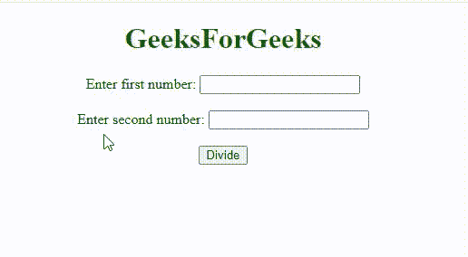

# 如何在 JavaScript 中检查第一个数字是否能被第二个数字整除？

> 原文:[https://www . geesforgeks . org/如何检查第一个数字是否可被 javascript 中的第二个一整除/](https://www.geeksforgeeks.org/how-to-check-first-number-is-divisible-by-second-one-in-javascript/)

给定两个数字，任务是在 JavaScript 的帮助下检查第一个数字是否能被第二个数字整除。

在进入编码部分之前，首先让我们了解一下模运算符和三等分。要找出一个数是否能被另一个数整除，我们只需使用提醒运算符，如果余数为 0，则它可以整除，否则不能整除。

**示例:**

```
variable a = 10; 
variable b = 5;

if ((a % b) == 0) {
    // a is divisible by b
else {
    //a is not divisible by b
}

```

我们使用了**= = "**运算符来比较表达式的值。但是在 JavaScript 中，我们使用“**= = = =”(三重等于)。**

**使用 Triple equals 的原因:**Triple 等号测试两个值之间的严格相等性。您比较的类型和值必须完全相同。

**严格相等的例子:**

```
4 === 4
// true (Both numbers, equal values)

'gfg' === 'gfg'
// true (Both Strings, equal values)

54 === '54'
// false (Number compared with String)

```

双重相等测试松散相等并执行类型强制。这意味着我们在将两个值转换为一个公共类型后进行比较。

**示例:**

```
3 == '3'
// true

```

因此，我们在 JavaScript 中使用 **"=== "(三倍等于)，而不是 **"== "(二倍等于)。****

**示例:**这是在 JavaScript 中检查第一个数字参数是否可以被第二个数字参数整除的代码。

## 超文本标记语言

```
<!DOCTYPE html>
<html>

<body style="text-align:center;">

    <h1 style="color:green;">
        GeeksForGeeks
    </h1>

    <p>
        Enter first number:
        <input type="text" id="txt1" name="text1"><br>
        <br> Enter second number:
        <input type="text" id="txt2" name="text2"><br>
        <br>
        <button onclick="myFunction()">Divide</button>
    </p>

    <p id="demo" style="font-size: 20px; 
        font-weight: bold;">
    </p>

    <script>
        function myFunction() {
            var a = Number(document.getElementById("txt1").value);
            var b = Number(document.getElementById("txt2").value);

            const isDivisible =
                (dividend, divisor) => dividend % divisor === 0;
            if (a % b === 0) {
                document.getElementById("demo").innerHTML =
                    a + " is divisible by " + b;
            } else {
                document.getElementById("demo").innerHTML =
                    a + " is not divisible by " + b;
            }
        }
    </script>
</body>

</html>
```

**输出:**



**因此，这就是在 JavaScript 中检查第一个数字参数是否能被第二个数字参数整除的方法。**