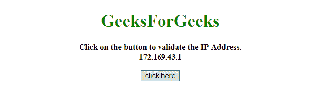
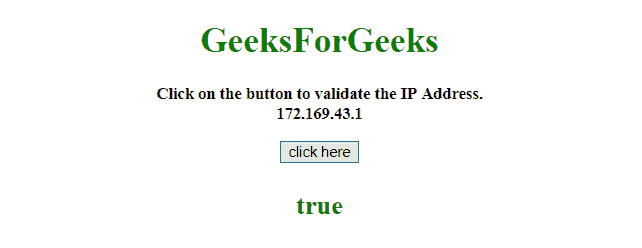
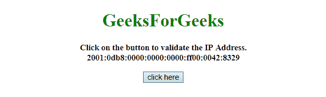
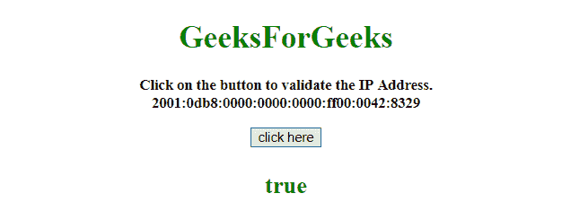

# 如何用 javascript 中的正则表达式检查 IP 地址？

> 原文:[https://www . geesforgeks . org/如何使用 javascript 正则表达式检查 ip 地址/](https://www.geeksforgeeks.org/how-to-check-for-ip-address-using-regular-expression-in-javascript/)

任务是验证 IPv4 和 IPv6 的 IP 地址。这里我们将使用正则表达式来解决这个问题。
**进场 1:**

*   **正则表达式:**在上面拆分 IP 地址。(点)并检查每个元素是否有效(0-255)。

**实施例 1:** 该实施例使用上述方法。

```
<!DOCTYPE HTML>
<html>

<head>
    <title>
        How to check for IP address 
      using regular expression in javascript?
    </title>
</head>
<center>

    <body style="text-align:center;">
        <h1 style="color:green;">  
        GeeksForGeeks  
    </h1>
        <p id="GFG_UP" 
           style="font-size: 15px; 
                  font-weight: bold;">
        </p>
        <button onclick="GFG_Fun()">
            click here
        </button>
        <p id="GFG_DOWN"
           style="font-size: 24px;
                  font-weight: bold;
                  color: green;">
        </p>
        <script>
            var up = document.getElementById('GFG_UP');
            var down = document.getElementById('GFG_DOWN');
            var addr = '172.169.43.1';
            up.innerHTML =
              "Click on the button to validate the IP Address.<br>"
            + addr;

            function GFG_Fun() {
                down.innerHTML = 
/^(25[0-5]|2[0-4][0-9]|[01]?[0-9][0-9]?)\.(25[0-5]|2[0-4][0-9]|[01]?[0-9][0-9]?)\.(25[0-5]|2[0-4][0-9]|[01]?[0-9][0-9]?)\.(25[0-5]|2[0-4][0-9]|[01]?[0-9][0-9]?)$/.test(addr);
            }
        </script>
    </body>
</center>

</html>
```

**输出:**

*   **点击按钮前:**
    
*   **点击按钮后:**
    

**方法 2:**

*   RegExp: **将 IP 地址拆分在:(冒号)上，并检查每个元素是否有效(0000-ffff)。**

**示例 2:** 该示例使用上述方法。

```
<!DOCTYPE HTML>
<html>

<head>
    <title>
        How to check for IP address 
      using regular expression in javascript?
    </title>
</head>
<center>

    <body style="text-align:center;">
        <h1 style="color:green;">  
        GeeksForGeeks  
    </h1>
        <p id="GFG_UP" 
           style="font-size: 15px; 
                  font-weight: bold;">
        </p>
        <button onclick="GFG_Fun()">
            click here
        </button>
        <p id="GFG_DOWN" 
           style="font-size: 24px;
                  font-weight: bold; 
                  color: green;">
        </p>
        <script>
            var up = document.getElementById('GFG_UP');
            var down = document.getElementById('GFG_DOWN');
            var addr = '2001:0db8:0000:0000:0000:ff00:0042:8329';
            up.innerHTML = 
              "Click on the button to validate the IP Address.<br>" 
            + addr;

            function GFG_Fun() {
                down.innerHTML = 
/^[a-fA-F0-9]{1, 4}\:[a-fA-F0-9]{1, 4}\:[a-fA-F0-9]{1, 4}\:[a-fA-F0-9]{1, 4}\:[a-fA-F0-9]{1, 4}\:[a-fA-F0-9]{1, 4}\:[a-fA-F0-9]{1, 4}\:[a-fA-F0-9]{1, 4}$/.test(addr);
            }
        </script>
    </body>
</center>

</html>
```

**输出:**

*   **点击按钮前:**
    
*   **点击按钮后:**
    