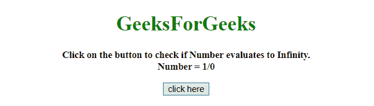
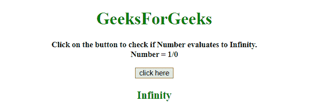
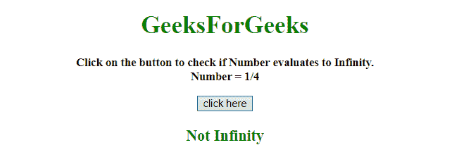

# 如何用 JavaScript 检查一个数字是否求值为无穷大？

> 原文:[https://www . geesforgeks . org/如何使用 javascript 检查数字是否等于无穷大/](https://www.geeksforgeeks.org/how-to-check-if-a-number-evaluates-to-infinity-using-javascript/)

任务是在 JavaScript 的帮助下检查数字是否评估为无穷大。这里讨论一些技巧。
**进场 1:**

*   检查数字是否等于 **[数字。](https://www.geeksforgeeks.org/what-is-positive-infinity-in-javascript/)T3 或**T5 号。NEGATIVE_INFINITY** 。**

**示例 1:** 该示例使用如上所述的方法。

```
<!DOCTYPE HTML>
<html>

<head>
    <title>
        Check if a Number evaluates to Infinity.
    </title>
</head>

<body style="text-align:center;"
      id="body">
    <h1 style="color:green;" 
        id="h1">  
            GeeksForGeeks  
        </h1>
    <p id="GFG_UP"
       style="font-size: 15px; 
              font-weight: bold;">
    </p>
    <button onclick="GFG_Fun()">
        click here
    </button>
    <p id="GFG_DOWN" 
       style="color:green; 
              font-size: 20px; 
              font-weight: bold;">
    </p>
    <script>
        var up = document.getElementById('GFG_UP');
        var down = document.getElementById('GFG_DOWN');
        var n = 1 / 0;
        up.innerHTML = "Click on the button to check if"+
          " Number evaluates to Infinity.<br> Number = 1/0";

        function GFG_Fun() {
            if (n == Number.POSITIVE_INFINITY || n == Number.NEGATIVE_INFINITY) {
                down.innerHTML = "Infinity";
            } else {
                down.innerHTML = "Not Infinity";
            }
        }
    </script>
</body>

</html>
```

**输出:**

*   **点击按钮前:**
    
*   **点击按钮后:**
    

**方法 2:**

*   使用**number . is inite()方法**检查数字是否有限。

**示例 2:** 该示例使用如上所述的方法。

```
<!DOCTYPE HTML>
<html>

<head>
    <title>
        Check if a Number evaluates to Infinity.
    </title>
</head>

<body style="text-align:center;">
    <h1 style="color:green;">  
            GeeksForGeeks  
        </h1>
    <p id="GFG_UP" 
       style="font-size: 15px;
              font-weight: bold;">
    </p>
    <button onclick="GFG_Fun()">
        click here
    </button>
    <p id="GFG_DOWN" 
       style="color:green; 
              font-size: 20px; 
              font-weight: bold;">
    </p>
    <script>
        var up = document.getElementById('GFG_UP');
        var down = document.getElementById('GFG_DOWN');
        var n = 1 / 4;
        up.innerHTML = "Click on the button to check if"+
          " Number evaluates to Infinity.<br> Number = 1/4";

        function GFG_Fun() {
            if (!Number.isFinite(n)) {
                down.innerHTML = "Infinity";
            } else {
                down.innerHTML = "Not Infinity";
            }
        }
    </script>
</body>

</html>
```

**输出:**

*   **点击按钮前:**
    
*   **点击按钮后:**
    