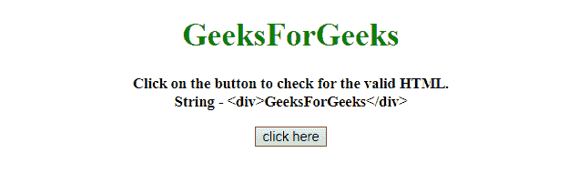
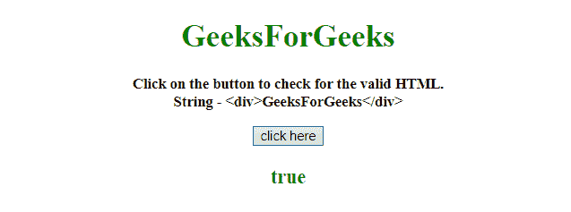
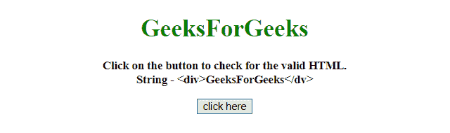
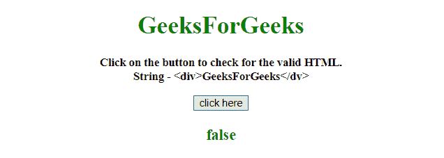

# 如何用 JavaScript 检查一个字符串是不是 html？

> 原文:[https://www . geesforgeks . org/如何检查字符串是否是 html 或不使用 javascript/](https://www.geeksforgeeks.org/how-to-check-if-a-string-is-html-or-not-using-javascript/)

任务是使用 JavaScript 验证给定的字符串是否是有效的 HTML。我们将讨论一些技巧。

**接近**

*   将 HTML 字符串放入变量中。
*   创建一个检查验证的正则表达式。
*   正则表达式应该遵循创建 HTML 文档的规则。

**示例 1:** 在本例中，创建了一个正则表达式，它正在验证 HTML 字符串是否有效。

```
<!DOCTYPE HTML>
<html>

<head>
    <title>
        JavaScript 
      | Check if a string is html or not.
    </title>
</head>

<body style="text-align:center;" 
      id="body">
    <h1 style="color:green;" 
        id="h1">  
            GeeksForGeeks  
        </h1>
    <p id="GFG_UP" 
       style="font-size: 15px;
              font-weight: bold;">
    </p>
    <button onclick="GFG_Fun()">
        click here
    </button>
    <p id="GFG_DOWN"
       style="color:green;
              font-size: 20px;
              font-weight: bold;">
    </p>
    <script>
        var up = document.getElementById('GFG_UP');
        var str1 = '<div>GeeksForGeeks</div>';
        var str = '<div>GeeksForGeeks</div>';

        up.innerHTML = "Click on the button to check "+
          "for the valid HTML.<br> String - " + str1;

        var down = document.getElementById('GFG_DOWN');

        function GFG_Fun() {
            down.innerHTML = 
/<(?=.*? .*?\/ ?>|br|hr|input|!--|wbr)[a-z]+.*?>|<([a-z]+).*?<\/\1>/i.test(str);
        }
    </script>
</body>

</html>
```

**输出:**

*   **点击按钮前:**
    
*   **点击按钮后:**
    

**示例 2:** 在这个示例中，这里也创建了一个正则表达式，它正在验证 HTML 字符串是否无效。

```
<!DOCTYPE HTML>
<html>

<head>
    <title>
        JavaScript 
      | Check if a string is html or not.
    </title>
</head>

<body style="text-align:center;" 
      id="body">
    <h1 style="color:green;" 
        id="h1">  
            GeeksForGeeks  
        </h1>
    <p id="GFG_UP" 
       style="font-size: 15px;
              font-weight: bold;">
    </p>
    <button onclick="GFG_Fun()">
        click here
    </button>
    <p id="GFG_DOWN"
       style="color:green;
              font-size: 20px;
              font-weight: bold;">
    </p>
    <script>
        var up = document.getElementById('GFG_UP');
        var str1 = '<div>GeeksForGeeks</dv>';
        var str = '<div>GeeksForGeeks</dv>';

        up.innerHTML = "Click on the button to check "+
          "for the valid HTML.<br> String - " + str1;

        var down = document.getElementById('GFG_DOWN');

        function GFG_Fun() {
            down.innerHTML = 
 /<([A-Za-z][A-Za-z0-9]*)\b[^>]*>(.*?)<\/\1>/.test(str);
        }
    </script>
</body>

</html>
```

**输出:**

*   **点击按钮前:**
    
*   **点击按钮后:**
    