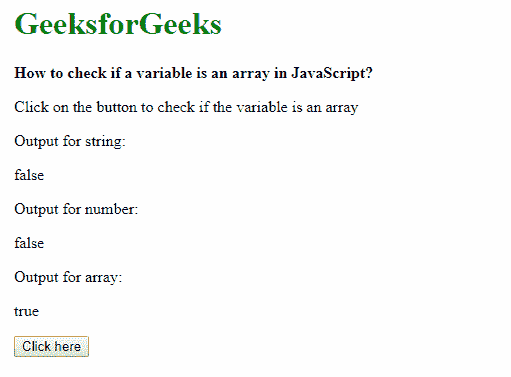

# 如何在 JavaScript 中检查变量是否为数组？

> 原文:[https://www . geesforgeks . org/如何检查变量是否是 javascript 中的数组/](https://www.geeksforgeeks.org/how-to-check-if-a-variable-is-an-array-in-javascript/)

在 JavaScript 中，我们可以使用 3 种方法来检查变量是否是数组，使用 **isArray 方法**，使用运算符的**实例，以及使用**检查构造函数类型**是否匹配数组对象。**

*   **Method 1: Using the isArray method**

    Array.isArray()方法检查传递的变量是否为 Array 对象。

    **语法:**

    ```
    Array.isArray(variableName)
    ```

    如果变量是数组，则返回真布尔值，否则返回假值。这在下面的示例中显示。

    **示例-1:**

    ```
    <!DOCTYPE html>
    <html lang="en">

    <head>
        <title>
          How to check if a variable
          is an array in JavaScript?
      </title>
    </head>

    <body>
        <h1 style="color: green">
          GeeksforGeeks
      </h1>
        <b>
          How to check if a variable 
          is an array in JavaScript?
      </b>
        <p>
          Click on the button to check
          if the variable is an array
      </p>
        <p>Output for string:
            <div class="outputString">
      </div>

        <p>Output for number:
            <div class="outputNumber">
      </div>

        <p>Output for array:
            <div class="outputArray">
      </div>

        <button onclick="checkArray()">
          Click here
      </button>
        <script type="text/javascript">
            function checkArray() {
                let str = 'This is a string';
                let num = 25;
                let arr = [10, 20, 30, 40];

                ans = Array.isArray(str);
                document.querySelector(
                  '.outputString').textContent = ans;

                ans = Array.isArray(num);
                document.querySelector(
                  '.outputNumber').textContent = ans;

                ans = Array.isArray(arr);
                document.querySelector(
                  '.outputArray').textContent = ans;
            }
        </script>
    </body>

    </html>
    ```

    **输出:**
    

*   **Method 2: Using the instanceof operator**
    The instanceof operator is used to test whether the prototype property of a constructor appears anywhere in the prototype chain of an object. This can be used to evaluate if an the given variable has a prototype of ‘Array’.

    **语法:**

    ```
    variable instanceof Array
    ```

    如果变量与指定的相同(此处为数组)，则运算符返回真布尔值，否则返回假值。这在下面的示例中显示。

    **示例-2:**

    ```
    <!DOCTYPE html>
    <html lang="en">

    <head>
        <title>
          How to check if a variable is
          an array in JavaScript?
      </title>
    </head>

    <body>
        <h1 style="color: green">
          GeeksforGeeks
      </h1>
        <b>
          How to check if a variable is
          an array in JavaScript?
      </b>
        <p>
          Click on the button to check 
          if the variable is an array
      </p>
        <p>Output for string:
            <div class="outputString"></div>

        <p>Output for number:
            <div class="outputNumber"></div>

        <p>Output for array:
            <div class="outputArray"></div>

        <button onclick="checkArray()">Click here</button>
        <script type="text/javascript">
            function checkArray() {
                let str = 'This is a string';
                let num = 25;
                let arr = [10, 20, 30, 40];

                ans = str instanceof Array;
                document.querySelector(
                  '.outputString').textContent = 
                  ans;
                ans = num instanceof Array;
                document.querySelector(
                   '.outputNumber').textContent = 
                  ans;
                ans = arr instanceof Array;
                document.querySelector(
                   '.outputArray').textContent = 
                  ans;
            }
        </script>
    </body>

    </html>
    ```

    **输出:**
    

*   **Method 3: Checking the constructor property of the variable**

    检查变量是数组的另一种方法是用 array 检查它的构造函数。

    **语法:**

    ```
    variable.constructor === Array
    ```

    如果变量与指定的相同(这里是一个数组)，则为真，否则为假。这在下面的示例中显示。

    **示例-3:**

    ```
    <!DOCTYPE html>
    <html lang="en">

    <head>
        <title>
          How to check if a variable is
          an array in JavaScript?
      </title>
    </head>

    <body>
        <h1 style="color: green">
          GeeksforGeeks
      </h1>
        <b>How to check if a variable is
          an array in JavaScript?</b>

        <p>Click on the button to check 
          if the variable is an array</p>

        <p>Output for string:
            <div class="outputString"></div>

        <p>Output for number:
            <div class="outputNumber"></div>

        <p>Output for array:
            <div class="outputArray"></div>

        <button onclick="checkArray()">
          Click here
      </button>
        <script type="text/javascript">
            function checkArray() {
                let str = 'This is a string';
                let num = 25;
                let arr = [10, 20, 30, 40];

                ans = str.constructor === Array;
                document.querySelector(
                  '.outputString').textContent = ans;

                ans = num.constructor === Array;
                document.querySelector(
                  '.outputNumber').textContent = ans;

                ans = arr.constructor === Array;
                document.querySelector(
                  '.outputArray').textContent = ans;

            }
        </script>
    </body>

    </html>
    ```

    **输出:**

    

JavaScript 最出名的是网页开发，但它也用于各种非浏览器环境。您可以通过以下 [JavaScript 教程](https://www.geeksforgeeks.org/javascript-tutorial/)和 [JavaScript 示例](https://www.geeksforgeeks.org/javascript-examples/)从头开始学习 JavaScript。