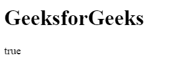
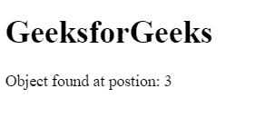

# 如何在 JavaScript 中检查数组是否包含对象？

> 原文:[https://www . geesforgeks . org/如何检查数组是否包含 javascript 中的对象/](https://www.geeksforgeeks.org/how-to-check-if-an-array-includes-an-object-in-javascript/)

有各种方法可以检查数组是否包含对象。
**使用 includes()方法:**如果数组中包含一个对象/元素可以通过使用 **includes()** 方法来确定。如果数组包含对象/元素，此方法返回 true，否则返回 false。
**语法:**

```
array.includes( element/object, startingPosition )
```

**例:**

## 超文本标记语言

```
<!DOCTYPE html>
<html>

<head>
    <title>
        JavaScript includes() Method
    </title>
</head>

<body>

    <h1>GeeksforGeeks</h1>

    <p id="geeks"></p>

    <!-- Script to check array include
        object or not -->
    <script>
        var obj = {"geeks1":10, "geeks2":12}
        var gfg = ["geeks1", "geeks2", obj];

        /* Use JavaScript includes() method */
        var num = gfg.includes(obj, 0);

        document.getElementById("geeks").innerHTML
                    = num;
    </script>
</body>

</html>        
```

**输出:**



**使用 some()方法:**some()方法使用函数进行求值，并对数组中的每个元素执行一次函数。如果它在数组中找到对象/元素，则返回 true，并停止对剩余元素的执行，否则返回 false。
**语法:**

```
array.some( function(currValue, arrIndex, arrObj), this )
```

**例:**

## 超文本标记语言

```
<!DOCTYPE html>
<html>

<head>
    <title>
        JavaScript includes() Method
    </title>
</head>

<body>

    <h1>GeeksforGeeks</h1>

    <!-- Script to check array include
        object or not -->
    <script>

        /* Declare an array */
        var arr = ["geeks1", "geeks2", "geeks3",
                    {1:"geeks4", 2:"geeks5"}];

        var boolVar = arr.some( 
            value => { return typeof value == "object" } );

        document.write(boolVar);
    </script>
</body>

</html>                    
```

**输出:**


**使用 filter()方法:**filter()方法创建通过检查条件的所有元素/对象的数组。
**语法:**

```
array.filter( function(currValue, arrIndex, arrObj), this )
```

**例:**

## 超文本标记语言

```
<!DOCTYPE html>
<html>

<head>
    <title>
        JavaScript includes() Method
    </title>
</head>

<body>

    <h1>GeeksforGeeks</h1>

    <p id="geeks"></p>

    <!-- Script to check array include
        object or not -->
    <script>
        var obj = {"geeks1":10, "geeks2":12}
        var arr = ["geeks1", "geeks2", "geeks3", obj];

        if(arr.filter(value=> value==obj).length > 0)
            document.write("true");
        else
            document.write("false");
    </script>
</body>

</html>                    
```

**输出:**


**使用 findIndex()方法:**find index()方法返回搜索到的对象/元素在数组中的位置，并停止对其余元素的执行。如果找不到元素/对象，则返回-1。
**语法:**

```
array.findIndex( function(currValue, arrIndex, arrObj), this )
```

**例:**

## 超文本标记语言

```
<!DOCTYPE html>
<html>

<head>
    <title>
        JavaScript includes() Method
    </title>
</head>

<body>

    <h1>GeeksforGeeks</h1>

    <!-- Script to check array include
        object or not -->
    <script>

        /* Declare an array */
        var arr = ["geeks1", "geeks2", "geeks3",
                {"geeks1":10, "geeks2":12}];

        var num = arr.findIndex( 
            value => { return typeof value == "object" } );

        document.write("Object found at position: " + num);
    </script>
</body>

</html>                    
```

**输出:**



JavaScript 最出名的是网页开发，但它也用于各种非浏览器环境。您可以通过以下 [JavaScript 教程](https://www.geeksforgeeks.org/javascript-tutorial/)和 [JavaScript 示例](https://www.geeksforgeeks.org/javascript-examples/)从头开始学习 JavaScript。