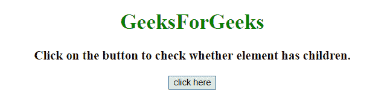
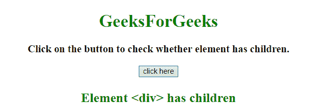
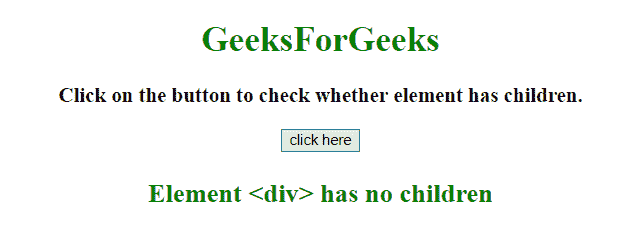

# 如何在 JavaScript 中检查一个元素是否有子元素？

> 原文:[https://www . geesforgeks . org/how-to-check-if-element-any-in-children-in-JavaScript/](https://www.geeksforgeeks.org/how-to-check-if-an-element-has-any-children-in-javascript/)

任务是在 JavaScript 的帮助下找出一个元素是否有子元素。我们将讨论一些技巧。

**进场:**

*   选择父元素。
*   使用 **firstChild、childNodes.length、children.length** 属性之一来查找元素是否有子元素。
*   **hasChildNodes()** 方法也可以用来寻找父节点的子节点。

**例 1:** 在本例中， **hasChildNodes()方法**用于确定**T6】div>T5】元素的子元素。**

```
<!DOCTYPE HTML>
<html>

<head>
    <title>
        How to check if element has
        any children in JavaScript ?
    </title>
</head>

<body style="text-align:center;">

    <h1 style="color:green;"> 
        GeeksForGeeks
    </h1>

    <div id="div">
        <p id="GFG_UP" style=
            "font-size: 19px; font-weight: bold;">
        </p>
    </div>

    <button onclick="GFG_Fun()">
        click here
    </button>

    <p id="GFG_DOWN" style=
        "color:green; font-size:24px; font-weight:bold;">
    </p>

    <script>
        var parentDiv = document.getElementById("div");
        var el_up = document.getElementById("GFG_UP");
        var el_down = document.getElementById("GFG_DOWN");

        el_up.innerHTML = "Click on the button to check "
                    + "whether element has children.";

        function GFG_Fun() {
            var ans = "Element <div> has no children";

            if (parentDiv.hasChildNodes()) {
                ans = "Element <div> has children";
            }

            el_down.innerHTML = ans;
        }
    </script>
</body>

</html>
```

**输出:**

*   **点击按钮前:**
    
*   **点击按钮后:**
    

**例 2:** 在本例中， **children.length Property** 用于确定**元素的子元素< div >** 。

```
<!DOCTYPE HTML>
<html>

<head>
    <title>
        How to check if element has
        any children in JavaScript ?
    </title>
</head>

<body style="text-align:center;">

    <h1 style="color:green;"> 
        GeeksForGeeks
    </h1>

    <div id="div">
        <p id="GFG_UP" style=
            "font-size: 19px; font-weight: bold;">
        </p>
    </div>

    <button onclick="GFG_Fun()">
        click here
    </button>

    <p id="GFG_DOWN" style=
        "color:green; font-size:24px; font-weight:bold;">
    </p>

    <script>
        var parentDiv = document.getElementById("div");
        var el_up = document.getElementById("GFG_UP");
        var el_down = document.getElementById("GFG_DOWN");

        el_up.innerHTML = "Click on the button to "+
                "check whether element has children.";

        function GFG_Fun() {
            var ans = "Element <div> has no children";

            if (parentDiv.children.length > 0) {
                ans = "Element <div> has children";
            }

            el_down.innerHTML = ans;
        }
    </script>
</body>

</html>
```

**输出:**

*   **点击按钮前:**
    
*   **点击按钮后:**
    