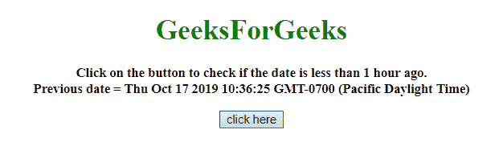
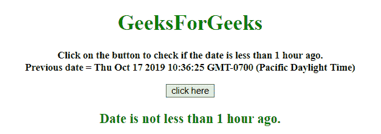
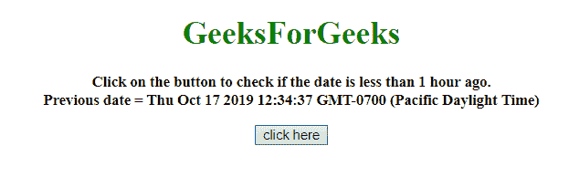
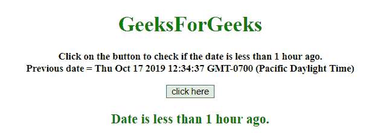

# 如何用 JavaScript 检查日期是否小于 1 小时前？

> 原文:[https://www . geesforgeks . org/如何使用 javascript 检查日期是否小于 1 小时前/](https://www.geeksforgeeks.org/how-to-check-if-date-is-less-than-1-hour-ago-using-javascript/)

给定一个日期，任务是在 JavaScript 的帮助下检查给定日期是否小于 1 小时前。

**方法 1:**

*   计算当前日期和 prev_date 之间的毫秒差。
*   如果这些值在 1 小时内大于毫秒，则返回 false，否则返回 true。

**示例:**该示例实现了上述方法。

```
<!DOCTYPE HTML> 
<html> 

<head> 
    <title> 
        How to check if date is less than
        1 hour ago using JavaScript ?
    </title>
</head> 

<body style = "text-align:center;"> 

    <h1 style = "color:green;" > 
        GeeksForGeeks 
    </h1>

    <p id = "GFG_UP" style = 
        "font-size: 15px; font-weight: bold;">
    </p>

    <button onclick = "gfg_Run()"> 
        click here
    </button>

    <p id = "GFG_DOWN" style = "color:green;
        font-size: 20px; font-weight: bold;">
    </p>

    <script>
        var el_up = document.getElementById("GFG_UP");
        var el_down = document.getElementById("GFG_DOWN");
        var prev_date = new Date();
        var d = new Date();

        Date.prototype.addHours = function(h) { 
            this.setTime(this.getTime() + (h*60*60*1000)); 
            return this; 
        }

        prev_date.addHours(-2);
        el_up.innerHTML = "Click on the button to "
                + "check if the date is less than "
                + "1 hour ago.<br>Previous date = "
                + prev_date;

        function gfg_Run() {

            // Hour in milliseconds
            var ONE_HOUR = 60 * 60 * 1000;

            if ((d - prev_date) < ONE_HOUR) {
                el_down.innerHTML = "Date is less"
                            + " than 1 hour ago.";
            }
            else {
                el_down.innerHTML = "Date is not "
                        + "less than 1 hour ago.";
            }
        }         
    </script> 
</body> 

</html>
```

**输出:**

*   **点击按钮前:**
    
*   **点击按钮后:**
    

**方法 2:**

*   从当前时间减去 1 小时毫秒。
*   比较当前日期和前一日期的毫秒数。
*   如果这些值在 1 小时内大于毫秒，则返回 false，否则返回 true。

**示例 2:** 该示例使用如上所述的方法。

```
<!DOCTYPE HTML> 
<html> 

<head> 
    <title> 
        How to check if date is less than
        1 hour ago using JavaScript ?
    </title>
</head> 

<body style = "text-align:center;"> 

    <h1 style = "color:green;" > 
        GeeksForGeeks 
    </h1>

    <p id = "GFG_UP" style = 
        "font-size: 15px; font-weight: bold;">
    </p>

    <button onclick = "gfg_Run()"> 
        click here
    </button>

    <p id = "GFG_DOWN" style = "color:green;
        font-size: 20px; font-weight: bold;">
    </p>

    <script>
        var el_up = document.getElementById("GFG_UP");
        var el_down = document.getElementById("GFG_DOWN");
        var prev_date = new Date();
        var d = new Date();

        const check = (date) => {
            const HOUR = 1000 * 60 * 60;
            const anHourAgo = Date.now() - HOUR;
            return date > anHourAgo;
        }
        el_up.innerHTML = "Click on the button to check"
                    + " if the date is less than 1 hour"
                    + " ago.<br>Previous date = " + prev_date;

        function gfg_Run() {
            var c = check(prev_date);

            if (c) {
                el_down.innerHTML = "Date is less "
                            + "than 1 hour ago.";
            }
            else {
                el_down.innerHTML = "Date is not less"
                            + " than 1 hour ago.";
            }
        }         
    </script> 
</body> 

</html>
```

**输出:**

*   **点击按钮前:**
    
*   **点击按钮后:**
    