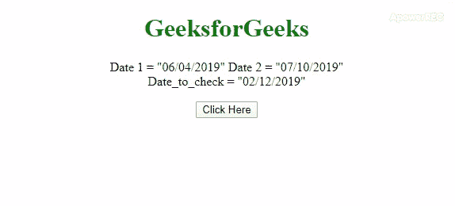
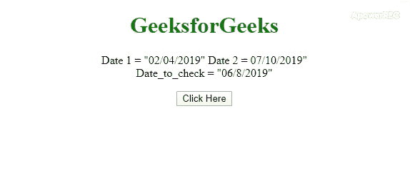

# 如何在 JavaScript 中检查一个日期是否在两个日期之间？

> 原文:[https://www . geesforgeks . org/如何检查一个日期是否在两个 javascript 日期之间/](https://www.geeksforgeeks.org/how-to-check-if-one-date-is-between-two-dates-in-javascript/)

任务是确定给定的日期是否在给定的两个日期之间？下面是在 JavaScript 帮助下讨论的一些最常用的技术。在第一种方法中，我们将使用 **[。拆分()方法](https://www.geeksforgeeks.org/javascript-string-prototype-split-function/)T3】和**新日期()构造器**。在第二种方法中，我们将使用 **[。getTime()方法](https://www.geeksforgeeks.org/javascript-gettime-method/)** 用**新建 Date()构造函数**。**

**进场 1:** 使用**。split()方法**对“/”上的日期进行拆分，得到数组中的日、月、年。我们必须从上一步获得的数组中构造日期，因为我们将使用**新的日期()构造函数**。因为这个方法返回 1970 年 1 月 1 日的秒数，所以比较日期变得很容易。

*   **示例:**该示例使用了上面讨论的方法。

    ```
    <!DOCTYPE HTML>
    <html>

    <head>
        <title>
            How to Check if one Date is between
            two dates using JavaScript ?
        </title>

        <style>
            body {
                text-align: center;
            }
            h1 {
                color: green;
            }
            #geeks {
                font-weight: bold;
            }
        </style>
    </head>

    <body>
        <h1>GeeksforGeeks</h1>

        <p>
            Date 1 = "06/04/2019"
            Date 2 = "07/10/2019"
            <br>Date_to_check = "02/12/2019"
        </p>

        <button onclick="gfg_Run()">
            Click Here
        </button>

        <p id="geeks"></p>

        <script>
            var el_down = document.getElementById("geeks");

            // Format - MM/DD/YYYY
            var Date_1 = "06/04/2019";
            var Date_2 = "07/10/2019";
            var Date_to_check = "02/12/2019";

            function gfg_Run() {
                D_1 = Date_1.split("/");
                D_2 = Date_2.split("/");
                D_3 = Date_to_check.split("/");

                var d1 = new Date(D_1[2], parseInt(D_1[1]) - 1, D_1[0]);
                var d2 = new Date(D_2[2], parseInt(D_2[1]) - 1, D_2[0]);
                var d3 = new Date(D_3[2], parseInt(D_3[1]) - 1, D_3[0]);

                if (d3 > d1 && d3 < d2) {
                    el_down.innerHTML = "Date is in between the "
                                        + "Date 1 and Date 2";
                } else {
                    el_down.innerHTML = "Date is not in between "
                                        + "the Date 1 and Date 2";
                }
            }
        </script>
    </body>

    </html>
    ```

*   **输出:**
    

**方法 2:** 这里首先使用**新的 Date()构造函数**并传递其中的字符串，该字符串构成一个 Date 对象。**这个。getTime()方法**返回的是 1970 年 1 月 1 日的秒数，可以很容易的比较秒数。

*   **示例:**该示例使用了上面讨论的方法。

    ```
    <!DOCTYPE HTML>
    <html>

    <head>
        <title>
            How to Check if one Date is between
            two dates using JavaScript ?
        </title>

        <style>
            body {
                text-align: center;
            }
            h1 {
                color: green;
            }
            #geeks {
                font-weight: bold;
            }
        </style>
    </head>

    <body>
        <h1>GeeksforGeeks</h1>

        <p>
            Date 1 = "06/04/2019" 
            Date 2 = "07/10/2019"
            <br>Date_to_check = "02/8/2019"
        </p>

        <button onclick="gfg_Run()">
            Click Here
        </button>

        <p id="geeks"></p>

        <script>
            var el_down = document.getElementById("geeks");

            // Format - MM/DD/YYYY
            var D1 = "06/04/2019";
            var D2 = "07/10/2019";
            var D3 = "02/8/2019";

            function gfg_Run() {
                D1 = new Date(D1);
                D2 = new Date(D2);
                D3 = new Date(D3);

                if (D3.getTime() <= D2.getTime()
                    && D3.getTime() >= D1.getTime()) {
                    el_down.innerHTML = "Date is in between"
                            + " the Date 1 and Date 2"; 
                } else {
                    el_down.innerHTML = "Date is not in"
                        + " between the Date 1 and Date 2";
                }
            }
        </script>
    </body>

    </html>
    ```

*   **输出:**
    