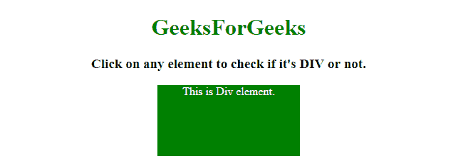
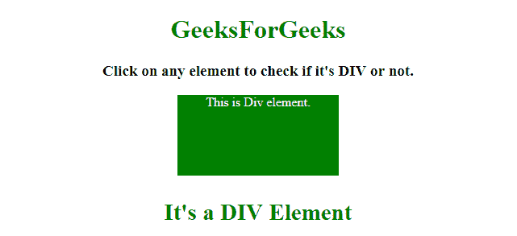
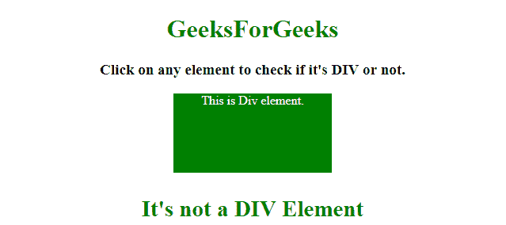

# 如何在 JavaScript 中检查被点击的元素是不是 div？

> 原文:[https://www . geesforgeks . org/如何检查被点击的元素是否是 javascript 中的 div 或 not](https://www.geeksforgeeks.org/how-to-check-if-the-clicked-element-is-a-div-or-not-in-javascript/)

给定一个包含许多元素的 HTML 文档。任务是在 JavaScript 的帮助下确定被点击的元素是否是 DIV。
这里讨论了两种方法，第一种方法使用元素的**标记名属性**，第二种方法使用运算符的**实例来搜索 DIV。
**进近 1:****

*   使用**元素标记名属性**，返回元素的标记名。(例如..如果(el.tagName == 'DIV ')，则它是 DIV，否则不是)

**示例 1:** 该示例实现了上述方法。

```
<!DOCTYPE HTML>
<html>

<head>
    <title>
        Check if an element is a div in JavaScript.
    </title>
    <style>
        #div {
            background: green;
            height: 100px;
            width: 200px;
            margin: 0 auto;
            color: white;
        }
    </style>
</head>

<body style="text-align:center;">
    <h1 style="color:green;" onClick="GFG_Fun(this.tagName)">  
            GeeksForGeeks  
        </h1>
    <p id="GFG_UP" onClick="GFG_Fun(this.tagName)">
    </p>
    <div id="div" onClick="GFG_Fun(this.tagName)">
        This is Div element.
    </div>
    <p id="GFG_DOWN" style="color: green;">
    </p>
    <script>
        var up = document.getElementById('GFG_UP');
        var down = document.getElementById('GFG_DOWN');
        up.innerHTML = 
          "Click on any element to check if it's DIV or not.";

        function GFG_Fun(tagName) {
            // checking if the tagName is equal to 'DIV'.
            if (tagName == 'DIV') {
                down.innerHTML = "It's a DIV Element";
            } else {
                down.innerHTML = "It's not a DIV Element";
            }
        }
    </script>
</body>

</html>
```

**输出:**

*   **点击元素前:**
    
*   **点击元素后:**
    

**方法 2:**

*   使用操作符的**实例，检查元素是否为**html dive element**。**

**示例 2:** 该示例实现了上述方法。

```
<!DOCTYPE HTML>
<html>

<head>
    <title>
        Check if an element is a div in JavaScript.
    </title>
    <style>
        #div {
            background: green;
            height: 100px;
            width: 200px;
            margin: 0 auto;
            color: white;
        }
    </style>
</head>

<body style="text-align:center;">
    <h1 style="color:green;" onClick="GFG_Fun(this)">  
            GeeksForGeeks  
        </h1>
    <p id="GFG_UP" onClick="GFG_Fun(this)">
    </p>
    <div id="div" onClick="GFG_Fun(this)">
        This is Div element.
    </div>
    <p id="GFG_DOWN" style="color: green;">
    </p>
    <script>
        var up = document.getElementById('GFG_UP');
        var down = document.getElementById('GFG_DOWN');
        up.innerHTML =
            "Click on any element to check if it's DIV or not.";

        function GFG_Fun(el) {
            // checking if the el is instance of HTMLDivElement
            if (el instanceof HTMLDivElement) {
                down.innerHTML = "It's a DIV Element";
            } else {
                down.innerHTML = "It's not a DIV Element";
            }
        }
    </script>
</body>

</html>
```

**输出:**

*   **点击元素前:**
    
*   **点击元素后:**
    