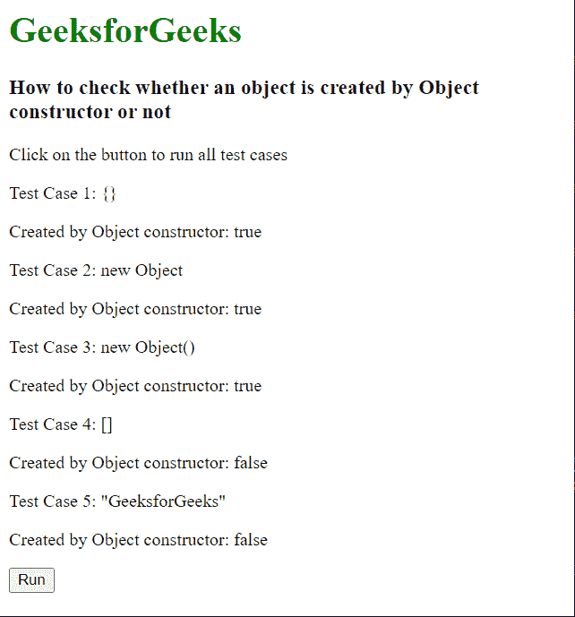

# 如何检查提供的值是否是 JavaScript 中 object 构造函数创建的对象？

> 原文:[https://www . geesforgeks . org/如何检查提供的值是否是由 javascript 中的对象构造函数创建的对象/](https://www.geeksforgeeks.org/how-to-check-if-the-provided-value-is-an-object-created-by-the-object-constructor-in-javascript/)

在本文中，我们将学习如何检查提供的值是否是由 JavaScript 中的对象构造函数创建的对象。JavaScript 中几乎所有的值都是对象，除了基元值。

**方法:**我们知道一个对象会有自己的属性和方法。对于任何 JavaScript 对象，都有一个称为**构造函数**属性的属性。此构造函数属性基本上返回对创建实例的构造函数的引用。例如，数组的构造函数属性将返回*数组*作为结果。同样，对于一个对象，它将返回一个对象。请注意，这些不是字符串值，而是对构造函数的引用。

如果一个值是由对象构造函数创建的，那么可以通过将对象的构造函数属性值与相应的对象构造函数引用进行比较来检查该值。这将根据比较结果返回一个布尔值。

**语法:**

```
return (obj.constructor === Object);
```

**示例:**

## 超文本标记语言

```
<html>
<body>
  <h1 style="color: green;">
    GeeksforGeeks
  </h1>
  <h3>How to check whether an object is
    created by Object constructor or not</h3>
  <p>Click on the button to run all test cases</p>

  <p>Test Case 1: {}</p>

  <p>Created by Object constructor: 
    <span id="testcase1"></span></p>
  <p>Test Case 2: new Object</p>

  <p>Created by Object constructor: 
    <span id="testcase2"></span></p>

  <p>Test Case 3: new Object()</p>

  <p>Created by Object constructor: 
    <span id="testcase3"></span></p>

  <p>Test Case 4: []</p>

  <p>Created by Object constructor: 
    <span id="testcase4"></span></p>

  <p>Test Case 5: "GeeksforGeeks"</p>

  <p>Created by Object constructor: 
    <span id="testcase5"></span></p>

  <button onclick="executeTestCases()">Run</button>
  <script>

    // Function to check if created by
    // Object constructor
    function checkCreatedByObjectConstructor(obj) {
      return obj.constructor === Object ? true : false
    }

    function executeTestCases() {
      document.getElementById("testcase1").textContent =
        checkCreatedByObjectConstructor({});

      document.getElementById("testcase2").textContent =
        checkCreatedByObjectConstructor(new Object);

      document.getElementById("testcase3").textContent =
        checkCreatedByObjectConstructor(new Object());

      document.getElementById("testcase4").textContent =
        checkCreatedByObjectConstructor([]);

      document.getElementById("testcase5").textContent =
        checkCreatedByObjectConstructor("GeeksforGeeks");
    }
  </script>
</body>
</html>
```

**输出:**

