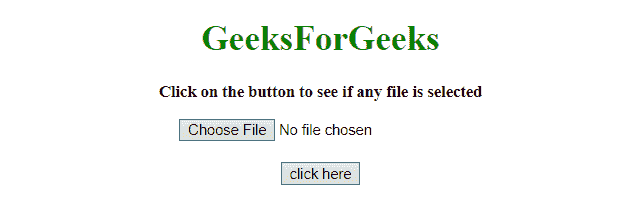
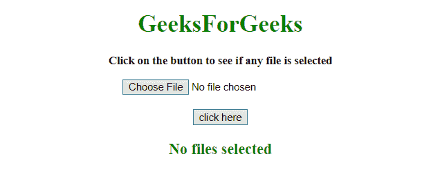
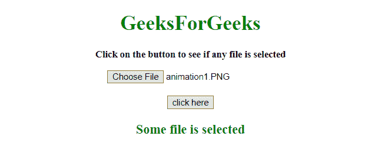

# 如何使用 JavaScript/jQuery 检查输入文件是否为空？

> 原文:[https://www . geesforgeks . org/如何检查输入文件是否为空-使用 javascript-jquery/](https://www.geeksforgeeks.org/how-to-check-input-file-is-empty-or-not-using-javascript-jquery/)

给定一个包含输入元素的 HTML 文档，任务是在 JavaScript 的帮助下检查输入元素是否为空。

**方法 1:** 使用**元素. files.length** 属性检查文件是否被选中。如果 element.files.length 属性返回 0，则不选择文件，否则选择文件。

**示例:**该示例实现了上述方法。

```
<!DOCTYPE HTML> 
<html> 

<head> 
    <title> 
        How to check input file is empty
        or not using JavaScript?
    </title>
</head>

<body style = "text-align:center;"> 

    <h1 style = "color:green;"> 
        GeeksForGeeks 
    </h1>

    <p id = "GFG_UP" style =
        "font-size: 15px; font-weight: bold;">
    </p>

    <input type="file" name="File" id="file" />

    <br><br>

    <button onclick = "GFG_Fun()">
        click here
    </button>

    <p id = "GFG_DOWN" style =
        "color:green; font-size: 20px; font-weight: bold;">
    </p>

    <script> 
        var up = document.getElementById('GFG_UP');
        var down = document.getElementById('GFG_DOWN');
        var file = document.getElementById("file");

        up.innerHTML = "Click on the button to see"
                    + " if any file is selected";

        function GFG_Fun() {
            if(file.files.length == 0 ){
                down.innerHTML = "No files selected";
            } else {
                down.innerHTML = "Some file is selected";
            }
        }
    </script> 
</body> 

</html>
```

**输出:**

*   **点击按钮前:**
    
*   **点击按钮后:**
    

**方法 2:** 使用 jQuery 中的 **element.files.length** 属性检查文件是否被选中。如果 element.files.length 属性返回 0，则不选择文件，否则选择文件。

**示例:**该示例实现了上述方法。

```
<!DOCTYPE HTML>  
<html>  

<head> 
    <title> 
       JavaScript | Check if input file is empty.
    </title>

    <script src=
"https://ajax.googleapis.com/ajax/libs/jquery/3.4.1/jquery.min.js">
    </script>
</head>

<body style = "text-align:center;">  

    <h1 style = "color:green;">  
        GeeksForGeeks  
    </h1>

    <p id = "GFG_UP" style = 
        "font-size: 15px; font-weight: bold;">
    </p>

    <input type="file" name="File" id="file" />

    <br><br>

    <button onclick = "GFG_Fun()">
        click here
    </button>

    <p id = "GFG_DOWN" style =
        "color:green; font-size: 20px; font-weight: bold;">
    </p>

    <script> 
        var up = document.getElementById('GFG_UP');
        var down = document.getElementById('GFG_DOWN');

        up.innerHTML = "Click on the button to see"
                    + " if any file is selected";

        function GFG_Fun() {
            if ($('#file')[0].files.length === 0) {
                down.innerHTML = "No files selected";
            } else {
                down.innerHTML = "Some file is selected";
            }
        }
    </script> 
</body>  

</html>
```

**输出:**

*   **点击按钮前:**
    
*   **点击按钮后:**
    