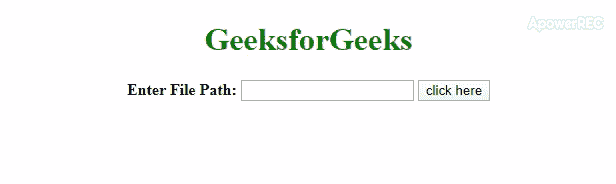

# 如何使用 JavaScript/jQuery 检查提到的文件是否存在？

> 原文:[https://www . geesforgeks . org/如何检查-提到的文件-存在或不存在-使用-javascript-jquery/](https://www.geeksforgeeks.org/how-to-check-mentioned-file-exists-or-not-using-javascript-jquery/)

有时我们想通过文件的路径上传文件，但很少情况下文件不存在。在这种情况下，我们必须响应用户给定的路径没有找到任何文件或者在提到的文件中不存在。

**方法 1:** 使用 jQuery 的 **[ajax()方法](https://www.geeksforgeeks.org/jquery-ajax-method/)** 检查给定网址上是否存在文件。ajax()方法用于触发异步 HTTP 请求。如果文件存在，ajax()方法会依次调用 **[ajaxSuccess()方法](https://www.geeksforgeeks.org/jquery-ajaxsuccess-method/)** 否则会调用 **Error 函数**。

*   **示例:**此示例说明了上述方法。

    ```
    <!DOCTYPE html>
    <html>

    <head>
        <title>
            How to check if file exist using jquery
        </title>
        <script src=
    "https://ajax.googleapis.com/ajax/libs/jquery/3.4.1/jquery.min.js">
        </script>
        <style>
            body {
                text-align: center;
            }

            h1 {
                color: green;
            }

            #output {
                color: green;
                font-size: 20px;
                font-weight: bold;
            }
        </style>
    </head>

    <body>
        <h1> 
            GeeksforGeeks 
        </h1>

        <label id="File_Path">
            <b>Enter File Path:</b>
        </label>

        <input type="text" id="File_URL">

        <button id="Check_File">
            click here
        </button>

        <p id="output"></p>

        <script>
            $(document).ready(function() {

                $("#Check_File").click(function() {

                    var url = $("#File_URL").val();
                    if (url != "") {
                        $.ajax({
                            url: url,
                            type: 'HEAD',
                            error: function() 
                            {
                                $("#output").text("File doesn't exists");
                            },
                            success: function() 
                            {
                                $("#output").text('File exists');
                            }
                        });
                    } else {
                        $("#Output").text("Please enter File URL");
                    }
                });
            });
        </script>
    </body>

    </html>
    ```

*   **输出:**
    

**方法 2:** 使用 **XMLHttpRequest()方法**触发 ajax 请求。如果 HTTP 状态为 200，则文件存在，否则文件不存在。

*   **示例:**此示例说明了上述方法。

    ```
    <!DOCTYPE HTML>
    <html>

    <head>
        <title>
            How to check if file exist or 
            not on HTTP status is 200
        </title>
        <style>
            body {
                text-align: center;
            }

            h1 {
                color: green;
            }

            #output {
                color: green;
                font-size: 20px;
                font-weight: bold;
            }
        </style>
    </head>

    <body>
        <h1> 
            GeeksforGeeks 
        </h1>

        <label id="File_Path">
            <b>Enter File Path: </b>
        </label>

        <input type="text" id="File_URL">
        <button id="Check_File" onclick="checkFileExist()">
            click here
        </button>

        <p id="output"></p>

        <script>
            var url = document.getElementById("File_URL");
            var output = document.getElementById("output");
            var http = new XMLHttpRequest();

            function checkFileExist() {
                if (url.length === 0) {
                    output.innerHTML = "Please enter File URL";
                } else {
                    http.open('HEAD', url, false);
                    http.send();
                    if (http.status === 200) {
                        output.innerHTML = "File exists";
                    } else {
                        output.innerHTML = "File doesn't exists";
                    }
                }
            }
        </script>
    </body>

    </html>                    
    ```

*   **输出:** HTTP 状态不是 200，所以如果文件存在，它会显示不存在，直到状态是 200。
    T3】

jQuery 是一个开源的 JavaScript 库，它简化了 HTML/CSS 文档之间的交互，它以其“少写多做”的理念而闻名。
跟随本 [jQuery 教程](https://www.geeksforgeeks.org/jquery-tutorials/)和 [jQuery 示例](https://www.geeksforgeeks.org/jquery-examples/)可以从头开始学习 jQuery。