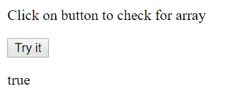
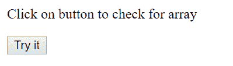
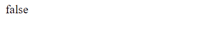
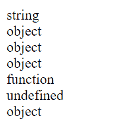

# 如何在 JavaScript 中检查对象是数组？

> 原文:[https://www . geesforgeks . org/how-to-check-object-is-in-array-in-JavaScript/](https://www.geeksforgeeks.org/how-to-check-object-is-an-array-in-javascript/)

**方法 1:使用 [Array.isArray()函数](https://www.geeksforgeeks.org/javascript-array-isarray-function/):**array . isarray()函数确定传递给该函数的值是否为数组。如果传递的参数是数组，则该函数返回 true，否则返回 false。

**语法:**

```
Array.isArray(obj)
```

这里，obj 是 JavaScript 中任何有效的对象，如映射、列表、数组、字符串等。

**返回值:**如果传递的对象是数组，则返回布尔值 true 如果传递的对象不是数组，则返回 false。

**示例 1:** 本示例使用 Array.isArray()函数检查对象是否为数组。

```
<!DOCTYPE html>
<html>

<head>
    <title>
        check object is an array
    </title>
</head>

<body>
    <p>
        Click on button to
        check for array
    </p>

    <button onclick="myFunction()">
        Try it
    </button>

    <p id="GFG"></p>

    <script>
        function myFunction() {
            var countries = ["India", "USA", "Canada"];
            var x = document.getElementById("GFG");
            x.innerHTML = Array.isArray(countries);
        }
    </script>
</body>

</html>                    
```

**输出:**


**示例 2:** 本示例使用 Array.isArray()函数检查对象是否为数组。

```
<!DOCTYPE html>
<html>

<head>
    <title>
        check object is an array
    </title>
</head>

<body>
    <p>
        Click on button to
        check for array
    </p>

    <button onclick="myFunction()">
        Try it
    </button>

    <p id="GFG"></p>

    <script>
        function myFunction() { 

            // It returns false as the object passed is
            // String not an array
            document.write(Array.isArray(
                    'hello GeeksForGeeks'));
        } 
    </script>
</body>

</html>                    
```

**输出:**

*   **点击按钮前:**
    
*   **点击按钮后:**
    

**示例 3:** 本示例使用 Array.isArray()函数检查对象是否为数组。

```
<!DOCTYPE html>
<html>

<head>
    <title>
        check object is an array
    </title>
</head>

<body>
    <p>
        Click on button to
        check for array
    </p>

    <button onclick="myFunction()">
        Try it
    </button>

    <p id="GFG"></p>

    <script>
        function myFunction() { 

            // It returns false as the object passed is
            // String not an array
            document.write(Array.isArray({k:12}));
        } 
    </script>
</body>

</html>                    
```

**输出:**

*   **点击按钮前:**
    
*   **点击按钮后:**
    

**方法 2:使用 typeof 运算符:**在 JavaScript 中，typeof 运算符以字符串的形式返回其操作数的数据类型，其中操作数可以是任何对象、函数或变量。然而，这种方法的问题是它不适用于确定数组。

**语法:**

```
typeof operand or typeof(operand)
```

**示例:**

```
<!DOCTYPE html>
<html>

<head>
    <title>
        check object is an array
    </title>
</head>

<body>
    <p id="GFG"></p> 

    <script> 
        document.getElementById("GFG").innerHTML
          = typeof "Geeks" + "<br>" + 
            typeof [1, 2, 3, 4] + "<br>" + 
            typeof {name:'Kartik', age:20} + "<br>" + 
            typeof new Date() + "<br>" + 
            typeof function () {} + "<br>" + 
            typeof job + "<br>" + 
            typeof null; 
    </script> 
</body> 

</html>                    
```

**输出:**
