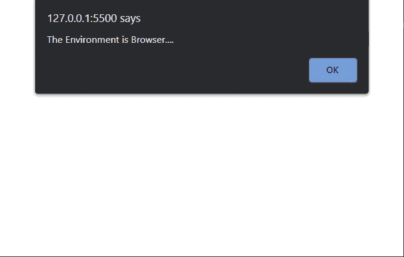

# 如何检查当前运行时环境是 JavaScript 中的浏览器？

> 原文:[https://www . geesforgeks . org/如何检查当前运行时环境-是 javascript 浏览器/](https://www.geeksforgeeks.org/how-to-check-the-current-runtime-environment-is-a-browser-in-javascript/)

在本文中，我们将看到如何检测运行 JavaScript 代码的运行时环境。假设您正在 Node.js 中构建一个应用程序，并且需要将该代码包含在将在浏览器上运行的网页中。这将导致节点应用程序的某些功能无法在浏览器上工作，反之亦然。

**方法:**没有函数、方法或属性来检测运行时环境是否是浏览器，但是，我们可以进行一些检查来识别脚本是否正在浏览器中运行。JavaScript 代码可以运行的一些环境是 Node.js、Service Workers 或网络浏览器。

每种类型的环境都有不同的条件。我们将创建一个函数，该函数将返回一个布尔值，指示环境是否是浏览器。在这个函数中，

*   我们首先使用操作符的*类型检查*过程*是否属于“对象”类型，以及*要求的*类型是否属于功能。当这两个条件都为真时，那么环境就是 Node.js，因此我们返回 false。*
*   我们通过检查*导入脚本*的类型是否是一个函数来类似地检查环境是否是一个服务工作者。如果条件匹配，我们再次返回 false。
*   最后，我们检查*窗口的类型*是否等于一个‘对象’。true 条件表示环境是浏览器，我们从函数返回 true。

**语法:**

```
function isBrowser() {

    // Check if the environment is Node.js
    if (typeof process === "object" &&
        typeof require === "function") {
        return false;
    }

    // Check if the environment is a
    // Service worker
    if (typeof importScripts === "function") {
        return false;
    }

    // Check if the environment is a Browser
    if (typeof window === "object") {
        return true;
    }
}
```

**示例:**

## 超文本标记语言

```
<!DOCTYPE html>
<html>

<body>
    <h1>Hello Geeks</h1>

    <script>
        function isBrowser() {

            // Check if the environment is Node.js
            if (typeof process === "object" &&
                typeof require === "function") {
                return false;
            }

            // Check if the environment is
            // a Service worker
            if (typeof importScripts === "function") {
                return false;
            }

            // Check if the environment is a Browser
            if (typeof window === "object") {
                return true;
            }
        }

        // Calling a alert if the environment is Browser
        if (isBrowser()) {
            alert("The Environment is Browser....")
        }
    </script>
</body>

</html>
```

**输出:**

