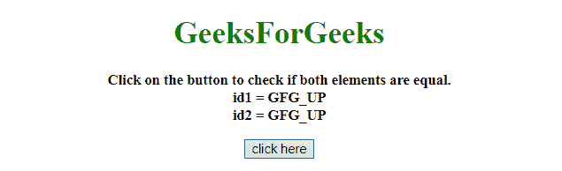
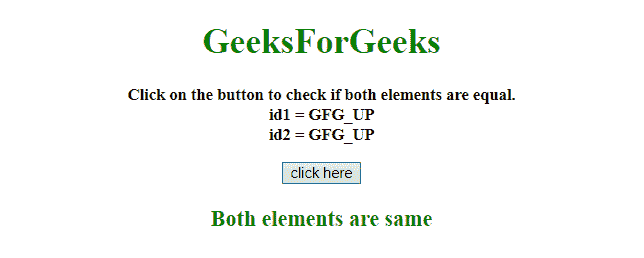
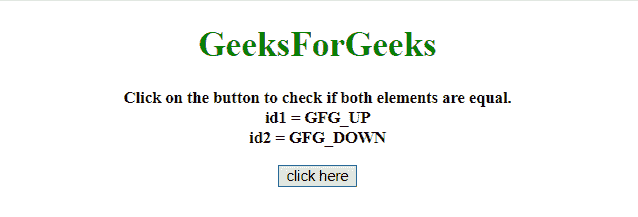
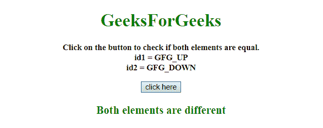

# 如何用 jQuery/JavaScript 检查两个元素是否相同？

> 原文:[https://www . geesforgeks . org/如何使用-jquery-javascript/](https://www.geeksforgeeks.org/how-to-check-two-elements-are-same-using-jquery-javascript/) 检查两个元素是否相同

给定一个包含两个元素的 HTML 文档，任务是在 JavaScript 的帮助下检查两个元素是否相同。

**方法 1:** 使用 **[is()方法](https://www.geeksforgeeks.org/jquery-is-method/)** 检查两个选定元素是否相同。它将一个元素作为参数，并检查它是否等于另一个元素。

**示例:**该示例实现了上述方法。

```
<!DOCTYPE HTML>  
<html>  

<head> 
    <title> 
       How to check two elements are same
       using jQuery/JavaScript?
    </title>

    <script src=
"https://ajax.googleapis.com/ajax/libs/jquery/3.4.1/jquery.min.js">
    </script>
</head>

<body style = "text-align:center;">  

    <h1 style="color:green;">  
        GeeksForGeeks  
    </h1>

    <p id = "GFG_UP" style =
        "font-size: 15px; font-weight: bold;">
    </p>

    <button onclick = "GFG_Fun()">
        click here
    </button>

    <p id = "GFG_DOWN" style =
        "color:green; font-size: 20px; font-weight: bold;">
    </p>

    <script> 
        var up = document.getElementById('GFG_UP');
        var down = document.getElementById('GFG_DOWN');
        var id1 = "GFG_UP";
        var id2 = "GFG_UP";

        up.innerHTML = "Click on the button to check if "
                + "both elements are equal.<br>" + "id1 = "
                + id1 + "<br>id2 = " + id2;

        function GFG_Fun() {
            if ($('#GFG_UP').is($('#GFG_UP'))) {
                down.innerHTML = "Both elements are same";
            } else {    
                down.innerHTML = "Both elements are different";
            }
        }
    </script> 
</body>  

</html>
```

**输出:**

*   **点击按钮前:**
    
*   **点击按钮后:**
    

**方法 2:****= =运算符**用于比较两个 JavaScript 元素。如果两个元素相等，则返回真，否则返回假。

**示例:**该示例采用了上述方法。

```
<!DOCTYPE HTML>  
<html>  

<head> 
    <title> 
        How to check two elements are same
        using jQuery/JavaScript ?
    </title>

    <script src=
"https://ajax.googleapis.com/ajax/libs/jquery/3.4.1/jquery.min.js">
    </script>
</head>

<body style = "text-align:center;">

    <h1 style="color:green;">  
        GeeksForGeeks  
    </h1>

    <p id = "GFG_UP" style =
        "font-size: 15px; font-weight: bold;">
    </p>

    <button onclick = "GFG_Fun()">
        click here
    </button>

    <p id = "GFG_DOWN" style =
        "color:green; font-size: 20px; font-weight: bold;">
    </p>

    <script> 
        var up = document.getElementById('GFG_UP');
        var down = document.getElementById('GFG_DOWN');
        var id1 = "GFG_UP";
        var id2 = "GFG_DOWN";

        up.innerHTML = "Click on the button to check if both"
                + " elements are equal.<br>" + "id1 = "
                + id1 + "<br>id2 = " + id2;

        function GFG_Fun() {
            if ($('#GFG_UP')[0] == $('#GFG_DOWN')[0]) {
                down.innerHTML = "Both elements are same";
            } else {    
                down.innerHTML = "Both elements are different";
            }
        }
    </script> 
</body>  

</html>
```

**输出:**

*   **点击按钮前:**
    
*   **点击按钮后:**
    