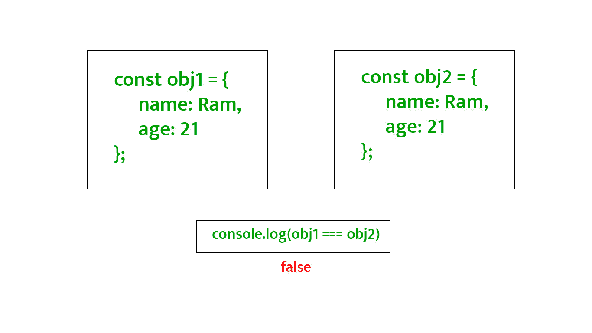

# 如何用 JavaScript 检查两个对象是否有相同的数据？

> 原文:[https://www . geesforgeks . org/如何使用 javascript 检查两个对象是否有相同的数据/](https://www.geeksforgeeks.org/how-to-check-two-objects-have-same-data-using-javascript/)

在 JavaScript 中，我们不能通过[等式运算符](https://www.geeksforgeeks.org/javascript-vs-comparision-operator) (double equals ==或 triple equals ===)直接比较两个对象，看它们是否相等。像这样比较两个对象会导致错误，即使它们有相同的数据。因为这是两个不同的对象实例，它们指的是两个不同的对象。



javascript 中没有直接的方法来检查两个对象是否有相同的数据。

下面是函数的伪代码，后面是代码片段:

**伪码:**

```
function hasSameData
    if both objects have the same number of keys (properties)
        if every key of obj1 matches with the corresponding key 
        of obj2 and values of the same keys of both objects match.
            return true
    return false

```

**进场:**

*   我们将通过 [Object.keys()](https://www.geeksforgeeks.org/object-keys-javascript/) 找到两个对象的键，返回该对象的键数组。
*   检查 *obj1* 中的每个键是否也存在于 *obj2* 中，如果这些键的值匹配，我们将使用 [every()](https://www.geeksforgeeks.org/javascript-array-prototype-every-function/) 方法。 **every()** 方法接受回调，并根据回调条件返回“真”或“假”。

**示例:**

## java 描述语言

```
<script>
    const obj1 = {
        name: 'Ram',
        age: 21
    };

    const obj2 = {
        name: 'Ram',
        age: 21
    };

    const haveSameData = function (obj1, obj2) {
        const obj1Length = Object.keys(obj1).length;
        const obj2Length = Object.keys(obj2).length;

        if (obj1Length === obj2Length) {
            return Object.keys(obj1).every(
                key => obj2.hasOwnProperty(key)
                    && obj2[key] === obj1[key]);
        }
        return false;
    }
    document.write(haveSameData(obj1, obj2));
</script>
```

**输出:**

```
true

```

**注意:**上述方法不适用于嵌套对象(T2 对象内部的对象和数组)。在这种情况下，它需要根据嵌套对象运行。

在嵌套对象的情况下，应用上述函数将会失败，如下所示:

## java 描述语言

```
<script>
    const obj1 = {
        name: 'Ram',
        age: 21,
        hobbies: ['Cricket', 'Swimming']
    };

    const obj2 = {
        name: 'Ram',
        age: 21,
        hobbies: ['Cricket', 'Swimming']
    };
    const haveSameData = function(obj1, obj2) {
        const obj1Length = Object.keys(obj1).length;
        const obj2Length = Object.keys(obj2).length;

        if(obj1Length === obj2Length) {
            return Object.keys(obj1).every(
                key => obj2.hasOwnProperty(key)
                   && obj2[key] === obj1[key]);
        }
        return false;
    }
    document.write(haveSameData(obj1, obj2));
</script>
```

**输出:**

```
false

```