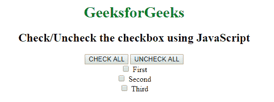
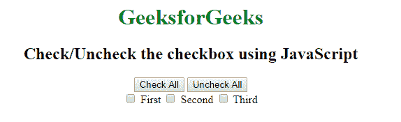

# 如何使用 JavaScript 勾选/取消勾选复选框？

> 原文:[https://www . geesforgeks . org/如何使用 javascript 检查-取消检查-复选框/](https://www.geeksforgeeks.org/how-to-check-uncheck-the-checkbox-using-javascript/)

**接近 1:** 使用复位按钮

1.  创建一个 javascript 函数。
2.  它允许在任何 HTML 文档或其他支持事件的对象上添加事件监听器。
3.  使用 **window.onload** 功能:用于页面一刷新或加载就执行任务。

**示例:**

```
<html>

<head>
    <title>Check/Uncheck the checkbox using JavaScript</title>
</head>

<body>
    <center>
        <h1 style="color:green">GeeksforGeeks</h1>
        <h2>Check/Uncheck the checkbox using JavaScript</h2>
        <form>
            <div>
                <input type="button" onclick="checkAll()" value="CHECK ALL">
                <input type="reset" value="UNCHECK ALL">
            </div>
            <div>
                <label>
                    <input type="checkbox" class="check3"> First
                </label>
            </div>
            <div>
                <label>
                    <input type="checkbox" class="check3"> Second
                </label>
            </div>
            <div>
                <label>
                    <input type="checkbox" class="check3"> Third
                </label>
            </div>
        </form>
    </center>
</body>
<script type="text/javascript">
    //create function of check/uncheck box
    function checkAll() {
        var inputs = document.querySelectorAll('.check3');
        for (var i = 0; i < inputs.length; i++) {
            inputs[i].checked = true;
        }
    }
    window.onload = function() {
        window.addEventListener('load', checkAll, false);
    }
</script>

</html>
```

**输出:**


**使用单独按钮接近 2:**

1.  创建两个 javascript 函数。
2.  请使用 window.addEventListener 和 window.onload 函数。

**示例:**

```
<html>

<head>
    <title>Check/Uncheck the checkbox using JavaScript</title>
</head>

<body>
    <center>
        <h1 style="color:green">GeeksforGeeks</h1>
        <h2>Check/Uncheck the checkbox using JavaScript</h2>
        <form>

            <div>
                <input type="button" onclick="checkAll()" value="Check All">
                <input type="button" onclick="uncheckAll()" value="Uncheck All">
            </div>

            <label>
                <input type="checkbox" class="check2"> First
            </label>

            <label>
                <input type="checkbox" class="check2"> Second
            </label>

            <label>
                <input type="checkbox" class="check2"> Third
            </label>

        </form>
    </center>
</body>
<script type="text/javascript">
    //create checkall function
    function checkAll() {
        var inputs = document.querySelectorAll('.check2');
        for (var i = 0; i < inputs.length; i++) {
            inputs[i].checked = true;
        }
    }
    //create uncheckall function
    function uncheckAll() {
        var inputs = document.querySelectorAll('.check2');
        for (var i = 0; i < inputs.length; i++) {
            inputs[i].checked = false;
        }
    }

    window.onload = function() {
        window.addEventListener('load', checkAll, false);
    }
</script>

</html>
```

**输出:**
