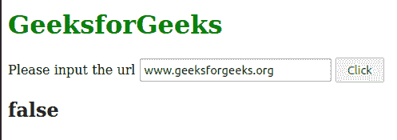
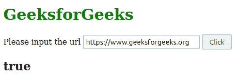

# 如何在 JavaScript 中检查给定的字符串是否是绝对 URL？

> 原文:[https://www . geeksforgeeks . org/如何检查给定的字符串是否是绝对 url 或不在 javascript 中/](https://www.geeksforgeeks.org/how-to-check-whether-a-given-string-is-an-absolute-url-or-not-in-javascript/)

在本文中，我们将学习如果给定的字符串是 JavaScript 中的绝对 URL，如何返回 true。有两种类型的网址，相对的和绝对的。

**绝对 URL:** 它是一个包含所有对定位资源很重要的信息的 URL。绝对网址中包含的东西是网址起点的站点域中的协议(HTTPS)。

**相对 URL:** 是一个简短的 URL，保存域名和确切的东西，只允许在同一服务器或页面上访问。

**语法:**

```
/* Absolute Url */
https://www.geeksforgeeks.org/

/* Relative Url */
geeksforgeeks.org
```

任务是创建一个 JavaScript 函数，该函数将一个参数作为 URL，如果 URL 是绝对链接，则返回 true，如果不是，则返回 false。

**方法:**绝对 URL 在开始时包含协议(HTTPS)。我们可以简单的检查一下网址前面是否有 **https://** 。如果发现了，我们还真还假。

为了检查协议，我们使用正则表达式。

**语法:**

```
^https:\/\/
```

**在哪里，**

*   **^:** 用于选择起步。
*   **https:** 用于选择文本。
*   **\:** 用于匹配前置字符的特殊正则表达式字符。

**示例:**下面的示例解释了上述方法的使用。

## 超文本标记语言

```
<!DOCTYPE html>
<html lang="en">

<body>
    <h1 style="color: green;">GeeksforGeeks</h1>
    <form action="#">
        <label for="#">Please input the url</label>
        <input type="text" id="url">
        <input type="button" onclick="absolute_url()" value="Click">
        <h2 id="result"></h2>
    </form>

    <script>
        function absolute_url() {
            let urls = document.getElementById('url').value;
            let result = document.getElementById('result');

            // Regex pattern for checking
            var pattern = /^https:\/\//i;

            // Check if pattern is there in the string 
            // or not with .test() method
            if (pattern.test(urls)) {
                result.innerText = "true";
            }
            else {
                result.innerText = "false";
            }
        }
    </script>
</body>

</html>
```

**输出:**

**对于非绝对网址:**



**绝对网址:**

