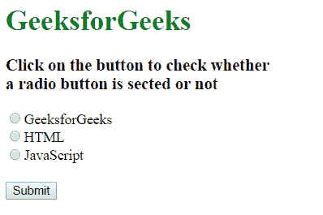
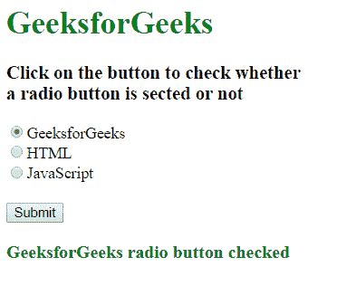

# 如何用 JavaScript 检查单选按钮是否被选中？

> 原文:[https://www . geesforgeks . org/如何用 javascript 检查单选按钮是否被选中/](https://www.geeksforgeeks.org/how-to-check-whether-a-radio-button-is-selected-with-javascript/)

给定一个包含单选按钮元素的表单，任务是在 JavaScript 的帮助下检查单选按钮是否被选中。有两种方法可以解决这个问题，讨论如下:

**使用[输入单选按钮选中属性](https://www.geeksforgeeks.org/html-dom-input-radio-checked-property/) :** 输入单选按钮选中属性用于返回输入单选按钮的选中状态。
使用**文档。已勾选**方法检查所选 id 的元素是否勾选。如果选中，则显示其相应的结果，否则检查下一条语句。如果没有选择任何单选按钮，则返回“没有选择任何人”。

**示例:**

```
<!DOCTYPE html>
<html>

<head>
    <title>
        How to check whether a radio button
        is selected with JavaScript ?
    </title>
</head>

<body> 

    <h1 style="color:green;">
        GeeksforGeeks
    </h1>

    <h3>
        Click on the button to check whether<br>
        a radio button is sected or not
    </h3>

    <form>
        <input type="radio" name="GFG" id="GFG"
            value="GeeksforGeeks">GeeksforGeeks<br>

        <input type="radio" name="GFG" id="HTML"
            value="HTML">HTML<br>

        <input type="radio" name="GFG" id="JS"
            value="JavaScript">JavaScript<br><br>

        <button type="button" onclick="display()">
            Submit
        </button>
    </form>
    <br>
    <div id="disp" style=
        "color:green; font-size:18px; font-weight:bold;">
    </div> 
</body> 
    <script>
        function display() { 
            if(document.getElementById('GFG').checked) {
                document.getElementById("disp").innerHTML
                    = document.getElementById("GFG").value
                    + " radio button checked";
            }
            else if(document.getElementById('HTML').checked) {
                document.getElementById("disp").innerHTML
                    = document.getElementById("HTML").value
                    + " radio button checked";  
            }
            else if(document.getElementById('JS').checked) {
                document.getElementById("disp").innerHTML
                    = document.getElementById("JS").value
                    + " radio button checked";  
            }
            else {
                document.getElementById("disp").innerHTML
                    = "No one selected";
            }
        }
    </script>
</html>       
```

**输出:**

*   **之前点击提交按钮:**
    
*   **点击提交按钮后:**
    

**使用 [DOM querySelector()方法](https://www.geeksforgeeks.org/html-dom-queryselector-method/):**query selector()方法用于返回与文档中指定的 CSS 选择器匹配的第一个元素。
使用**document . queryselector(' input[name = " GFG "]:checked ')**方法检查单选按钮的选中元素并显示其相应结果。如果没有选择任何单选按钮，则返回“没有选择任何人”

**示例:**

```
<!DOCTYPE html>
<html>

<head>
    <title>
        How to check whether a radio button
        is selected with JavaScript ?
    </title>
</head>

<body> 

    <h1 style="color:green;">
        GeeksforGeeks
    </h1>

    <h3>
        Click on the button to check whether<br>
        a radio button is sected or not
    </h3>

    <form>
        <input type="radio" name="GFG" id="GFG"
            value="GeeksforGeeks">GeeksforGeeks<br>

        <input type="radio" name="GFG" id="HTML"
            value="HTML">HTML<br>

        <input type="radio" name="GFG" id="JS"
            value="JavaScript">JavaScript<br><br>

        <button type="button" onclick="display()">
            Submit
        </button>
    </form>
    <br>
    <div id="disp" style=
        "color:green; font-size:18px; font-weight:bold;">
    </div> 
</body> 
    <script>
        function display() { 
            var checkRadio = document.querySelector(
                'input[name="GFG"]:checked');

            if(checkRadio != null) {
                document.getElementById("disp").innerHTML
                    = checkRadio.value
                    + " radio button checked";
            }
            else {
                document.getElementById("disp").innerHTML
                    = "No one selected";
            }
        }
    </script>
</html>
```

**输出:**

*   **之前点击提交按钮:**
    
*   **点击提交按钮后:**
    

JavaScript 最出名的是网页开发，但它也用于各种非浏览器环境。您可以通过以下 [JavaScript 教程](https://www.geeksforgeeks.org/javascript-tutorial/)和 [JavaScript 示例](https://www.geeksforgeeks.org/javascript-examples/)从头开始学习 JavaScript。