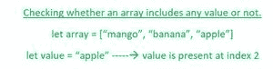

# 如何在 JavaScript 中检查数组是否包含特定值？

> 原文:[https://www . geesforgeks . org/如何检查数组是否包含特定的 javascript 值/](https://www.geeksforgeeks.org/how-to-check-whether-an-array-includes-a-particular-value-or-not-in-javascript/)

在本文中，我们将讨论数组的构造，然后检查用户所需的任何特定值是否包含在数组中。


但是让我们先看看如何使用以下语法在 JavaScript 中创建一个数组

**语法:**以下语法对任何用户轻松创建数组都很有帮助-

```
let array = [item_1 , item_2, item_3 , ...];
```

现在我们已经看到了数组的创建，让我们来看看检查数组本身是否包含用户希望查看的任何值的几种方法。



以下是我们可能实现的检查数组是否包含值的某些方法-

**方法 1:** 这是初始的、传统的方法，是任何个体在开始时能想到的最常见的方法。在这种方法中，我们将运行 for 循环，但是在运行 for 循环之前，我们将初始化我们的数组和我们正在寻找的值。在该 for 循环中，我们将查看数组中是否存在我们的值，然后连同值名一起返回该变量的索引。如果数组中不存在该值，我们将退出 for 循环，然后打印一条消息，说明数组中不存在该值。

**示例:**

## 超文本标记语言

```
<script>
    let fruits_array = [
      "mango",
      "banana",
      "apple",
      "pineapple",
      "pomegranate",
      "orange",
    ];

    let valueChecker = (value) => {
      for (let i = 0; i < fruits_array.length; i++) {
        let current_value = fruits_array[i];
        if (value === current_value) {
          return value + " is present at index: " + i;
        }
      }
      return value + " is not included in this array..";
    };

    console.log(valueChecker("apple"));
    console.log(valueChecker("app"));
    console.log(valueChecker("banana"));
</script>
```

**输出:**

```
apple is present at index: 2
app is not included in this array..
banana is present at index: 1
```

**方法 2:** 分析完以上传统最常用的方法，现在这是最新的方法。在这个方法中，我们将使用 [**。包括()**](https://www.geeksforgeeks.org/javascript-string-includes-method/) 方法来检查数组中是否存在值。如果该值存在，那么我们将打印说明该值存在于数组中的消息。如果该值不存在，我们将打印说明该值不存在的消息。

**示例:**

## 超文本标记语言

```
<script>
    let fruits_array = [
      "mango",
      "banana",
      "apple",
      "pineapple",
      "pomegranate",
      "orange",
    ];

    let value_1 = "apple";
    let value_2 = "app";
    console.log(fruits_array.includes(value_1));
    console.log(fruits_array.includes(value_2));
</script>
```

**输出:**

```
true
false
```

**方法 3:** 在此方法中，我们将使用 **indexOf()** 方法。通过使用这种方法，我们将检查我们正在寻找的特定元素的索引值是否大于或等于零，然后我们将打印说明该元素以某个索引值存在的消息。如果数组中没有我们的元素，那么我们将显示一条错误消息，说明数组中缺少该元素。

## 超文本标记语言

```
<script>
    let fruits_array = [
      "mango",
      "banana",
      "apple",
      "pineapple",
      "pomegranate",
      "orange",
    ];

    let checkValue = (value) => {
      if (fruits_array.indexOf(value) >= 0)
        return value + " is present at index : "
          + fruits_array.indexOf(value);
      else 
        return value + " is not present in this array";
    };

    console.log(checkValue("apple"));
    console.log(checkValue("app"));
    console.log(checkValue("mango"));
</script>
```

**输出:**

```
apple is present at index : 2
app is not present in this array
mango is present at index : 0
```