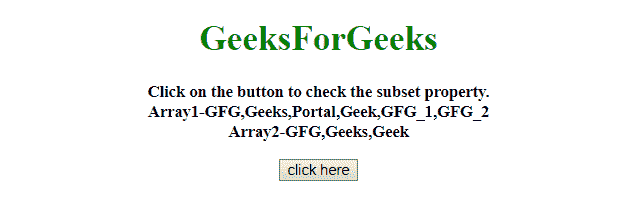
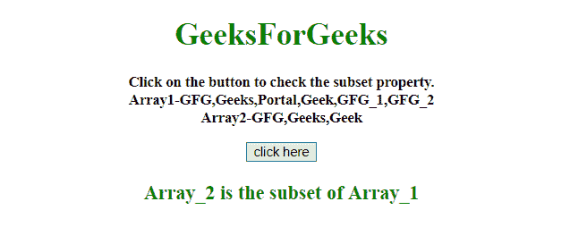
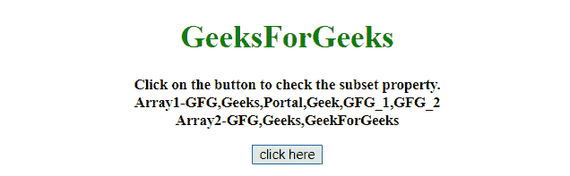
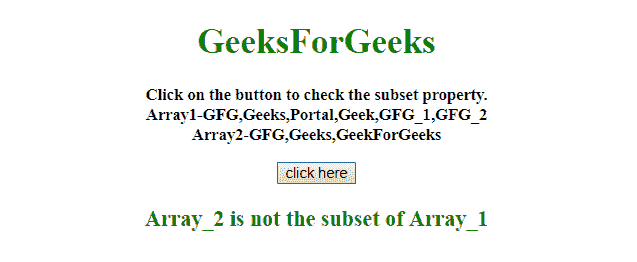

# 如何用 JavaScript 检查一个数组是否是另一个数组的子集？

> 原文:[https://www . geesforgeks . org/如何使用 javascript 检查一个数组是否是另一个数组的子集/](https://www.geeksforgeeks.org/how-to-check-whether-an-array-is-subset-of-another-array-using-javascript/)

任务是在 JavaScript 的帮助下检查一个数组是否是另一个数组的子集。这里讨论了一些技巧。
**进场 1:**

*   这种方法检查第二个数组的每个元素是否出现在第一个数组中。

**示例 1:** 该示例使用如上所述的方法。

```
<!DOCTYPE HTML>
<html>

<head>
    <title>
        check whether an array is 
      subset of another array using JavaScript
    </title>
</head>

<body style="text-align:center;">
    <h1 style="color:green;">  
            GeeksForGeeks  
        </h1>
    <p id="GFG_UP" 
       style="font-size: 15px;
              font-weight: bold;">
    </p>
    <button onclick="GFG_Fun()">
        click here
    </button>
    <p id="GFG_DOWN" 
       style="color:green;
              font-size: 20px;
              font-weight: bold;">
    </p>
    <script>
        var up = document.getElementById('GFG_UP');
        var down = document.getElementById('GFG_DOWN');
        var arr1 = ["GFG", "Geeks", "Portal", "Geek", "GFG_1", "GFG_2"];
        var arr2 = ["GFG", "Geeks", "Geek"];
        up.innerHTML = 
          "Click on the button to check the subset property."+
          "<br>Array1-" + arr1 + "<br>Array2-" + arr2;

        function GFG_Fun() {
            res = arr2.every(function(val) {
                return arr1.indexOf(val) >= 0;
            });
            not = "";
            if (!res) {
                not = "not";
            }
            down.innerHTML = 
              "Array_2 is " + not + " the subset of Array_1";
        }
    </script>
</body>

</html>
```

**输出:**

*   **点击按钮前:**
    
*   **点击按钮后:**
    

**方法 2:**

*   如果第二个数组的某些元素不在第一个数组中，这种方法就声明为 false。

**示例 2:** 该示例使用如上所述的方法。

```
<!DOCTYPE HTML>
<html>

<head>
    <title>
        check whether an array is subset 
      of another array using JavaScript
    </title>
</head>

<body style="text-align:center;">
    <h1 style="color:green;">  
            GeeksForGeeks  
        </h1>
    <p id="GFG_UP" 
       style="font-size: 15px;
              font-weight: bold;">
    </p>
    <button onclick="GFG_Fun()">
        click here
    </button>
    <p id="GFG_DOWN" 
       style="color:green;
              font-size: 20px; 
              font-weight: bold;">
    </p>
    <script>
        var up = document.getElementById('GFG_UP');
        var down = document.getElementById('GFG_DOWN');
        var arr1 = ["GFG", "Geeks", "Portal", "Geek", "GFG_1", "GFG_2"];
        var arr2 = ["GFG", "Geeks", "GeekForGeeks"];
        up.innerHTML = "Click on the button to check the subset property."+
          "<br>Array1-" + arr1 + "<br>Array2-" + arr2;

        function GFG_Fun() {
            res = !arr2.some(val => arr1.indexOf(val) === -1);
            not = "";
            if (!res) {
                not = "not";
            }
            down.innerHTML = "Array_2 is " 
            + not + " the subset of Array_1";
        }
    </script>
</body>

</html>
```

**输出:**

*   **点击按钮前:**
    
*   **点击按钮后:**
    