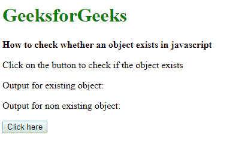
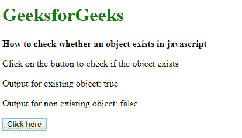

# 如何在 javascript 中检查一个对象是否存在？

> 原文:[https://www . geesforgeks . org/如何检查对象是否存在于 javascript 中/](https://www.geeksforgeeks.org/how-to-check-whether-an-object-exists-in-javascript/)

可以使用两种方法来检查对象是否存在:

**方法 1:使用 typeof 运算符**
type of 运算符以字符串形式返回调用它的变量的类型。任何不存在的对象的返回字符串都是“未定义的”。这可用于检查对象是否存在，因为不存在的对象将总是返回“未定义”。

**语法:**

```
if (typeof objectToBeTested != "undefined")
    // object exists
else
    // object does not exist
```

**示例:**

```
<!DOCTYPE html>
<html>

<head>
    <title>How to check whether an 
      object exists in javascript</title>
</head>

<body>
    <h1 style="color: green">
      GeeksforGeeks
  </h1>
    <b>How to check whether an 
      object exists in javascript</b>

    <p>Click on the button to
      check if the object exists</p>

    <p>Output for existing object: 
      <span class="outputExist"></span></p>
    <p>Output for non existing object: 
      <span class="outputNonExist"></span></p>

    <button onclick="checkObjectExists()">
      Click here
  </button>
    <script type="text/javascript">
        function checkObjectExists() {
            // create an existing object for comparison
            let existingObject = {};

            if (typeof existingObject != "undefined") {
                ans = true;
            } else {
                ans = false
            }

            document.querySelector(
              '.outputExist').textContent = ans;

            if (typeof nonExistingObject != "undefined") {
                ans = true;
            } else {
                ans = false;
            }

            document.querySelector(
              '.outputNonExist').textContent = ans;
        }
    </script>
</body>

</html>
```

**输出:**

*   **点击按钮前:**
    
*   **点击按钮后:**
    

**方法 2:使用 try-catch 语句捕捉引用错误**
访问不存在的对象时，总是会抛出**引用**错误。可以使用 try-catch 块来确定此错误。可以访问元素的任何随机属性来引发此错误。

**语法:**

```
try {
    objectToBeTested.prop;
    // object exists
}
catch {
    // object does not exist
}
```

**示例:**

```
<!DOCTYPE html>
<html>

<head>
    <title>How to check whether 
      an object exists in javascript</title>
</head>

<body>
    <h1 style="color: green">
      GeeksforGeeks
  </h1>
    <b>How to check whether an 
      object exists in javascript</b>

    <p>Click on the button to check 
      if the object exists</p>
    <p>Output for existing object:
      <span class="outputExist"></span></p>

    <p>Output for non existing object: 
      <span class="outputNonExist"></span></p>

    <button onclick="checkObjectExists()">Click here</button>
    <script type="text/javascript">
        function checkObjectExists() {

            // create an existing object for comparison
            let existingObject = {};

            try {
                // accessing a random property
                existingObject.prop;
                ans = true;
            } catch {
                ans = false;
            }

            document.querySelector(
              '.outputExist').textContent = ans;

            try {
                // accessing a random property
                nonExistingObject.prop;
                ans = true;
            } catch {
                ans = false;
            }

            document.querySelector(
              '.outputNonExist').textContent = ans;

        }
    </script>
</body>

</html>
```

**输出:**

*   **点击按钮前:**
    
*   **点击按钮后:**
    