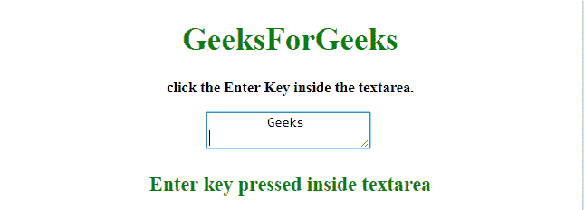

# 如何使用 JavaScript / jQuery 检查文本框中的回车键是否被按下？

> 原文:[https://www . geeksforgeeks . org/如何检查在文本框中是否按了回车键-使用 javascript-jquery/](https://www.geeksforgeeks.org/how-to-check-whether-the-enter-key-is-pressed-in-a-textbox-or-not-using-javascript-jquery/)

给定一个 textarea 元素，任务是在 JQuery 的帮助下检查用户是否按了回车键。

*   **jQuery keyup() Method:** This method triggers the keyup event or adds a function to run when a keyup event occurs. The keyup event occurs when a keyboard key is released.

    **语法:**

    *   **触发所选元素的按键事件:**

    ```
    $(selector).keyup()

    ```

*   **给按键事件附加一个功能:**

    ```
    $(selector).keyup(function)

    ```

**参数:**包含单参数**事件**，可选。它指定了当按键事件被触发时要运行的函数。

*   **jQuery trigger() Method:** This method triggers the defined event and the default behavior of an event for the selected elements.

    **语法:**

    ```
    $(selector).trigger(event, eventObj, param1, param2, ...)

    ```

    **参数:**

    *   **事件:**此参数为必填项。它为指定的元素指定要触发的事件。事件可以是自定义的，也可以是任何标准的。
    *   **参数 1，参数 2，…:** 此参数为可选参数。它指定要传递给事件处理程序的额外参数。在自定义事件的情况下，附加参数特别有用。*   **jQuery on() Method:** This method adds one or more event handlers for the selected elements and child elements.

    **语法:**

    ```
    $(selector).on(event, childSelector, data, function, map)

    ```

    **参数:**

    *   **事件:**此参数为必填项。它指定一个或多个要附加到选定元素的事件或命名空间。如果有多个事件值，这些值用空格隔开。事件必须是有效的。
    *   **儿童选择器:**该参数可选。它指定事件处理程序应该只附加到已定义的子元素。
    *   **数据:**此参数为可选。它指定要传递给函数的附加数据。
    *   **功能:**此参数为必选项。它指定事件发生时要运行的函数。
    *   **映射:**它指定了一个事件映射({event:func()，event:func()，…})，该事件映射有一个或多个要添加到所选元素的事件，以及事件发生时要运行的函数。

    **示例 1:** 在本例中，**按键事件**被添加到**文本区**，当其发生时，则通过**按键**事件触发新事件 **enterKey** 。

    ```
    <!DOCTYPE HTML> 
    <html> 
        <head> 
            <title> 
                Event for user pressing enter
                button in a textbox
            </title>

            <script src = 
    "https://ajax.googleapis.com/ajax/libs/jquery/3.4.0/jquery.min.js">
            </script>
        </head> 

        <body style = "text-align:center;">

            <h1 id = "h" style = "color:green;" > 
                GeeksForGeeks 
            </h1>

            <p id = "GFG_UP" style = 
                "font-size: 15px; font-weight: bold;">
                click the Enter Key inside the textarea.
            </p>

            <textarea></textarea>
            <br>     

            <p id = "GFG_DOWN" style = 
                "color:green; font-size: 20px; font-weight: bold;">
            </p>

            <script>
                $('textarea').keyup(function(e) {
                    if(e.keyCode == 13) {
                        $(this).trigger("enterKey");
                    }
                });         
                $('textarea').on("enterKey", function(e){
                    $("#GFG_DOWN").text("Enter key pressed inside textarea");
                });                             
            </script> 
        </body> 
    </html>                    
    ```

    **输出:**

    *   **点击按钮前:**
        
    *   **点击按钮后:**
        

    **例 2:** 在本例中，**按键事件**被添加到**文本区**中，当其发生时，在文本区内按下的消息- **回车键被打印在屏幕上，而不会触发新的事件来处理它。**

    ```
    <!DOCTYPE HTML> 
    <html> 
        <head> 
            <title> 
                Check enter key pressed in a
                textbox using JavaScript
            </title>

            <script src = 
    "https://ajax.googleapis.com/ajax/libs/jquery/3.4.0/jquery.min.js">
            </script>
        </head> 

        <body style = "text-align:center;">

            <h1 id = "h" style = "color:green;" > 
                GeeksForGeeks 
            </h1>

            <p id = "GFG_UP" style =
                "font-size: 15px; font-weight: bold;">
                click the Enter Key inside the textarea.
            </p>

            <textarea></textarea>
            <br>     

            <p id = "GFG_DOWN" style = 
                "color:green; font-size: 20px; font-weight: bold;">
            </p>

            <script>
                $('textarea').keyup(function(e) {
                    if(e.keyCode == 13) {
                        $("#GFG_DOWN").text("Enter key pressed inside textarea");
                    }
                });                     
            </script> 
        </body> 
    </html>                    
    ```

    **输出:**

    *   **点击按钮前:**
        
    *   **点击按钮后:**
        