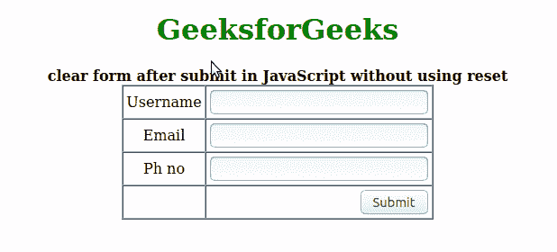

# 不使用重置如何在 Javascript 中提交后清除表单？

> 原文:[https://www . geesforgeks . org/如何在不使用重置的情况下清除 javascript 提交后的表单/](https://www.geeksforgeeks.org/how-to-clear-form-after-submit-in-javascript-without-using-reset/)

javascript 中的表单用于从用户那里获取选择性的或必需的信息。有各种各样的领域和目的来使用表格，例如，在招聘中，在申请某种工作时，或者在询问某些类型的问题时。当表单不在线时，分发表单很容易，但是当涉及到在线领域时，人们不能分发表单，他们必须为每个人使用相同的结构。在这种情况下，他们创造了一个良好的结构，并提供给每一个想要经历这个特殊过程的人，这很容易在网上进一步进行。

提交表格是填写表格后的过程，填写好的表格必须提交给当局。但是设计者的工作是处理表单的编程部分。在本节中，我们将了解如何在不使用 reset 的情况下，在用 Javascript 提交表单后清除表单？

**示例:**让我们借助 Tables 创建一个 Html 表单。这里取表格中的一些字段，即姓名、电话号码、电子邮件、描述和提交按钮。这些字段必须带有 id。在这段代码中，我们使用的是提交类型，通过这种类型，我们的表单将被提交，但是为了使它从填写日期开始就免费，我们调用了 fun()函数。使用这个函数，我们将设置所有字段的值等于零。这个函数将用 javascript 和脚本标签编写。

```html
<!DOCTYPE html> 
<html> 

<head> 
    <title>Reseting the form without reset method</title> 
    <script>
        function fun(){
            document.getElementById('name').value='';
            document.getElementById('mail').value='';
            document.getElementById('phone').value='';
            }
    </script>
    <style>
        input[type=submit] {
            position: relative;
            float: right;
        }
    </style>
</head> 

<body> 
    <center> 
        <h1 style="color:green">GeeksforGeeks</h1> 
        <b> 
          clear form after submit in Javascript 
          without using reset
        </b> 
        <form id="d" action="/cgi-bin/test.cgi" name="geek"> 
            <table cellspacing="0" cellpadding="3" border="1"> 
                <tr> 
                    <td align="center">Username</td> 
                    <td> 
                        <input type="text" id="name"/> 
                    </td> 
                </tr> 
                <tr> 
                    <td align="center">Email</td> 
                    <td> 
                        <input type="text" id="mail"/> 
                    </td> 
                </tr> 
                <tr> 
                    <td align="center">Ph no</td> 
                    <td> 
                        <input type="tel" id="phone"/> 
                    </td> 
                </tr> 
                <tr> 
                    <td align="center"></td> 
                    <td> 
                        <input onclick="fun()" 
                               type="submit" value="Submit" /> 
                    </td> 
                </tr> 
            </table> 
        </form> 

    </center> 
</body> 

</html> 
```

**输出:**
