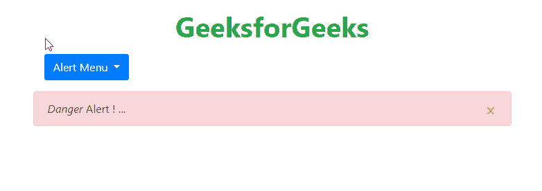
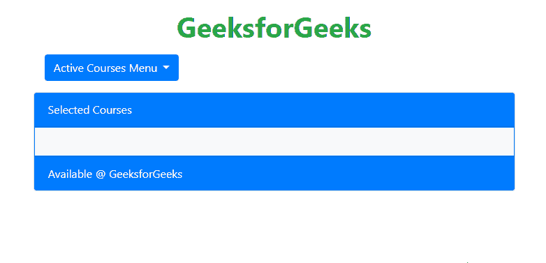

# 如何在 JavaScript 中清除上一次修改下拉菜单时追加的数据？

> 原文:[https://www . geesforgeks . org/how-clear-previous-attended-data-on-change-the-下拉菜单-in-javascript/](https://www.geeksforgeeks.org/how-to-clear-previous-appended-data-on-change-the-dropdown-menu-in-javascript/)

为了清除先前添加的变更数据，使用 jQuery 执行下拉。更改或切换下拉菜单时，必须清除附加数据，否则先前附加的数据将随当前菜单项数据一起附加。为了避免这个问题，jQuery 或 JavaScript 是借助 **add()，remove()，addClass()，**和 **removeClass()方法实现的。**

以下方法将解释清楚:

**方法 1:** 最初使用 **removeClass()** 方法移除先前附加的数据菜单项的活动类。然后用 **addClass()** 方法添加当前追加的数据菜单项的活动类。现在使用**各()**功能添加点击时添加或删除的活动类的数据。

*   **示例:**下方警报选择示例说明使用**移除()，添加()方法**清除更改下拉列表中先前附加的数据。

    ```
    <!DOCTYPE html>
    <html lang="en">

    <head>
        <meta charset="utf-8">
        <meta name="viewport" content="width=device-width, initial-scale=1">
        <link rel="stylesheet" href="
    https://maxcdn.bootstrapcdn.com/bootstrap/4.3.1/css/bootstrap.min.css">
        <script src="
    https://ajax.googleapis.com/ajax/libs/jquery/3.4.1/jquery.min.js">
        </script>
        <script src="
    https://cdnjs.cloudflare.com/ajax/libs/popper.js/1.14.7/umd/popper.min.js">
        </script>
        <script src="
    https://maxcdn.bootstrapcdn.com/bootstrap/4.3.1/js/bootstrap.min.js">
        </script>
    </head>

    <body>
        <div class="container">
            <h1 class="pt-3 text-success font-weight-bold text-center">
              GeeksforGeeks
            </h1>

            <div class="m-3 dropdown">
                <button type="button" 
                        class="btn btn-primary dropdown-toggle" 
                        data-toggle="dropdown">
                    Alert Menu
                </button>
                <div class="dropdown-menu">
                    <a class="dropdown-item" href="#">Success</a>
                    <a class="dropdown-item" href="#">Warning</a>
                    <a class="dropdown-item" href="#">Danger</a>
                </div>
            </div>
            <p id="alert" class="alert alert-dismissible">
                <button type="button" class="close" data-dismiss="alert">×
                </button><i id="demo"></i> Alert ! ...</p>
        </div>
        <script>
            $("a").click(function() {

                // removeClass active of previously selected menu item
                $('a.dropdown-item.active').removeClass("active");

                // Add class active to current selected menu item
                $(this).addClass("active");

                // Getting text from within selected elements
                var msg = $('a.dropdown-item.active').text();

                // If condition to check selected alert message
                if (msg == "Success") {
                    $("#alert").removeClass("alert-warning");
                    $("#alert").removeClass("alert-danger");
                    $("#alert").addClass("alert-success");
                } else if (msg == "Warning") {
                    $("#alert").removeClass("alert-success");
                    $("#alert").removeClass("alert-danger");
                    $("#alert").addClass("alert-warning");
                } else {
                    $("#alert").removeClass("alert-success");
                    $("#alert").removeClass("alert-warning");
                    $("#alert").addClass("alert-danger");
                }
                var str = "";
                $(".active").each(function() {

                    // Using html() to append html data
                    str += $(this).html() + " ";
                });
                $("#demo").html(str);
            }).click();
        </script>
    </body>

    </html>
    ```

*   **输出:**
    

**方法 2:** 最初用于循环删除先前附加的数据菜单项的活动类，这里循环条件基于借助 **remove()** 方法列出的项目长度。然后用 **add()** 方法添加当前所列附加数据菜单项的活动类。现在使用**各()**功能，在切换列出的项目时，添加或删除活动类的相关数据。

*   **示例:**下面的活动课程选择示例说明了如何使用 addClass()、removeClass()方法清除先前附加在更改下拉列表上的数据。

    ```
    <!DOCTYPE html>
    <html lang="en">

    <head>
        <meta charset="utf-8">
        <meta name="viewport" content="width=device-width, initial-scale=1">
        <link rel="stylesheet" href="
    https://maxcdn.bootstrapcdn.com/bootstrap/4.3.1/css/bootstrap.min.css">
        <script src="
    https://ajax.googleapis.com/ajax/libs/jquery/3.4.1/jquery.min.js">
        </script>
        <script src="
    https://cdnjs.cloudflare.com/ajax/libs/popper.js/1.14.7/umd/popper.min.js">
        </script>
        <script src="
    https://maxcdn.bootstrapcdn.com/bootstrap/4.3.1/js/bootstrap.min.js">
        </script>
    </head>

    <body>
        <div class="container">
            <h1 class="pt-3 text-success font-weight-bold text-center">
              GeeksforGeeks
            </h1>

            <div class="m-3 dropdown">
                <button type="button" 
                        class="btn btn-primary dropdown-toggle"
                        data-toggle="dropdown">
                    Active Courses Menu
                </button>
                <div class="dropdown-menu">
                    <a class="dropdown-item" href="#">
                     JAVA Backend Development 
                    </a>
                    <a class="dropdown-item" href="#">
                     DSA Foundation
                    </a>
                    <a class="dropdown-item" href="#">
                     GEEK Class
                    </a>
                    <a class="dropdown-item" href="#">
                     Machine Learning Foundation With Python & AI
                    </a>
                    <a class="dropdown-item" href="#">
                     Competitive Programming
                    </a>
                </div>
            </div>

            <div class="card">
                <div class="card-header bg-primary text-light">
                    Selected Courses</div>
                <div class="card-body p-3 bg-light 
                            text-dark border 
                            border-primary">
                    <h4 id="demo"></h4>
                </div>
                <div class="card-footer bg-primary text-light">
                    Available @ GeeksforGeeks
                </div>
            </div>

        </div>
        <script>
            $(".dropdown-item").click(function() {

                // Select all list items
                var dropItems = $(".dropdown-item");
                var str = "";

                // Remove 'active' tag for all list items
                // based on iteration
                for (let i = 0; i < dropItems.length; i++) {
                    dropItems[i].classList.remove("active");
                }

                // Add 'active' tag for currently selected item
                this.classList.add("active");
                $(".active").each(function() {

                    // Using text() to append text data
                    str += $(this).text() + " ";
                });
                $("#demo").text(str);
            });
        </script>
    </body>

    </html>
    ```

*   **输出:**
    