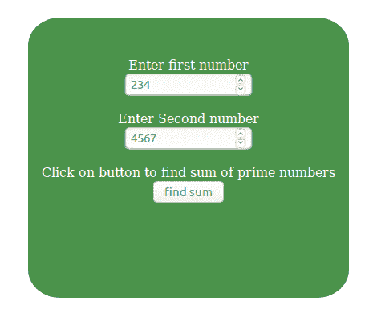

# 如何用 JavaScript 清除一个 div 的内容？

> 原文:[https://www . geesforgeks . org/如何使用 javascript 清除分区内容/](https://www.geeksforgeeks.org/how-to-clear-the-content-of-a-div-using-javascript/)

JavaScript 提供了清除 div 内容的功能。执行该功能有两种方法，一种是使用 **innerHTML 属性**，另一种是使用 **firstChild 属性**和 **removeChild()方法**。

**方法一:使用 [innerHTML 属性](https://www.geeksforgeeks.org/html-dom-innerhtml-property/):**DOM innerHTML 属性用于设置或返回元素的 HTML 内容。此方法将 innerHTML 属性设置为无。

```
<!DOCTYPE html>
<html>

<head>
    <title>
        Clear the content of a div
        using JavaScript
    </title>

    <style>
        #clear {
            background-color:#006600;
            color:white;
            padding-top:50px;
            opacity:0.7;
            width : 400px;
            height:250px;
            border-radius:10%;
            text-align:center;
        }
    </style>

    <!-- Script to use DOM innerHTML property
        to clear the content -->
    <script>
        function clearcontent(elementID) {
            document.getElementById(elementID).innerHTML = "";
        }
    </script>
</head>

<body>
    <div id= "clear">
        <form>
            <label>Enter first number</label><br>
            <input type = "number" placeholder = "Enter number"
                    name = "input1" min = "0"/>

            <br><br>

            <label>Enter Second number</label><br>
            <input type = "number" placeholder = "Enter number" 
                    name = "input2" min = "0"/>

            <br><br>

            <label>
                Click on button to find sum of prime numbers
            </label><br>
            <button value = "find sum" type = "submit" 
                    onclick = "clearcontent('clear')">
                find sum
            </button><br>
        </form>
    </div>
</body>

</html>
```

**输出:**

*   **点击按钮前:**
    
*   **点击按钮后:**
    

**方法 2:使用 [firstChild 属性](https://www.geeksforgeeks.org/html-dom-firstchild-property/)和 [removeChild()方法](https://www.geeksforgeeks.org/html-dom-removechild-method/):**DOM first child 属性用于返回其父节点元素的 firstchild Node。它是只读属性，不返回文本节点和注释节点。removeChild()方法用于移除给定元素的指定子节点。它将移除的节点作为节点对象返回，如果该节点不存在，则返回 null。此方法使用 firstChild 属性返回第一个子级，使用 removeChild()方法移除第一个子级的内容。

```
<!DOCTYPE html>
<html>

<head>
    <title>
        Clear the content of a div
        using JavaScript
    </title>

    <style>
        #clear {
            background-color:#006600;
            color:white;
            padding-top:50px;
            opacity:0.7;
            width : 400px;
            height:250px;
            border-radius:10%;
            text-align:center;
        }
    </style>

    <!-- Script to use DOM firstChild property and
        removeChild method to clear the content -->
    <script>
        function clearBox(elementID) {
            var div = document.getElementById(elementID);

            while(div.firstChild) {
                div.removeChild(div.firstChild);
            }
        }
    </script>
</head>

<body>
    <div id= "clear">
        <form>
            <label>Enter first number</label><br>
            <input type = "number" placeholder = "Enter number"
                    name = "input1" min = "0"/>

            <br><br>

            <label>Enter Second number</label><br>
            <input type = "number" placeholder = "Enter number" 
                    name = "input2" min = "0"/>

            <br><br>

            <label>
                Click on button to find sum of prime numbers
            </label><br>
            <button value = "find sum" type = "submit" 
                    onclick = "clearcontent('clear')">
                find sum
            </button><br>
        </form>
    </div>
</body>

</html>
```

**输出:**

*   **点击按钮前:**
    
*   **点击按钮后:**
    